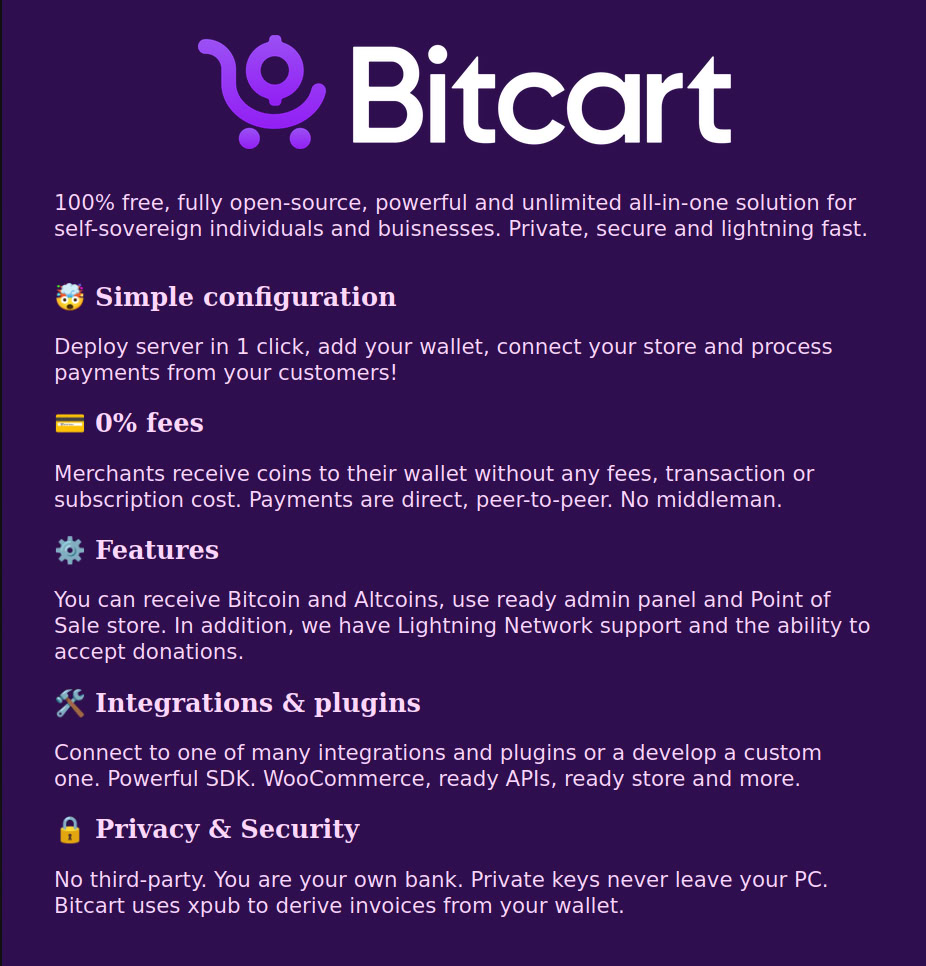

# Introduction

Bitcart is an open-source, self-hosted all-in-one solution for Bitcoin and other cryptocurrencies. You can use it in a variety of ways: from payment processing via our ready tools to custom applications via our SDK.

## Features 

- **Direct cryptocurrency payments:** no middleman between you and your customer. Money cannot stuck in the third-party wallet. This makes our system more secure and private. Also this means that you has **0% fees** (except crypto network fees).
- **No KYC**: not providing fiat conversion allows Bitcart merchants to avoid **KYC** and **AML** identification verification.
- **Easy deployment**: we provide different strategies of [deployment](deployment/README). You can run it **self-hosted** or use **Merchant API**, **SDK**, **admin panel** or [**POS**](guides/store-pos).
- **Flexibility**: Bitcart has wide catalog of **[integrations](integrations/shopify)** and **[plugins](plugins/eth-payments-plugin)**. Also you can use different [Coins daemons](https://bitcart.ai/coins) or add [a new](development/how-to-add-an-altcoin). Our system is extendable the right way.
- **Low system requirements**: Bitcart uses **SPV** technology by default, so minimal requirements are [less](deployment/README) than similar products. 
- **Private keys aren't required**.
- **Others**: also we support SegWit and Lightning Network.

## How it works

### In a nutshell 

In layman's terms, Bitcart is a solution for anything you might need to do in cryptocurrencies ecosystem.

If you need to process payments as a merchant, Bitcart can serve either as a full invoicing system, or just as a payment processor for cryptocurrencies' payment methods. When checking out, the customer will be presented with an invoice. The invoice is a fresh address from your wallet that wasn't used before. This way, by avoiding address re-use, your privacy is enhanced. Bitcart is using Electrum wallet protocol and it's SPV (Simple Payment Verification) feature to verify sent payments. After successful payment, your Bitcart instance can automate most of the work needed to fulfill the order safely. You are provided with ready solutions for your store, your company or application. Anything is possible with Bitcart.
### How is it different

Bitcart is a completely open source project. Every feature added, every change is documented and is publicly visible. There is no third-party between a merchant and a customer. Each merchant can set up their own individual instance, not dependent on other instances, or any third-party. Every action is under control of the merchant. As Bitcart is self-hosted, of course there are no processing or subscription fees.

As Bitcart is open source, everyone is welcome to read it's code, help in finding bugs and suggest new features! Security auditors can always inspect the quality of our code, and they have [a secure way](development/security-disclosures.md) to report vulnerabilities to make them fixed before they were used for bad

There are a few projects existing in the cryptocurrencies sphere targeting payment processing, but Bitcart is way more than just that. Payment processing is just one of the possible use-cases, but the user can always choose which parts of Bitcart to use.

As Bitcart contains many features, it is modular (while most other projects aren't). That means, for example, that if you only need to use the SDK for custom apps-just enable our daemons only. If you also need to have a ready Merchants API to use in a store-like application, enable it too. If you need a powerful admin panel, you can enable it. And so on, Bitcart consists of individual independent parts, which are easy to customize and use.

Another key difference is that, we are open to community ideas, and the project is built by the community and is influenced by the community. Every important decision taken is decided via a public poll. We are building a positive community having fun and making use of Bitcart, with the same goal: to make it even better.

### How it keeps funds secure 

Payments via Bitcart are direct, peer to peer. The merchant receives the coins directly to their wallet, with no intermediary. For each invoice, Bitcart generates a new address, belonging to the xpub entered, and this address is presented to the user. As this address is your wallet's address, you receive the funds directly. Bitcart just watches the payments, it can't modify anything along the way, as when configuring the [wallet](bitcart-basics/walkthrough.md#wallets), you only need to enter a watch-only [master public key](support-and-community/faq/terminology-faq.md#what-is-an-xpub). That way, you have complete control of the funds received.

### How it keeps data private 

The data is shared only between two parties - the buyer and a seller. Only the data required for the app operation is saved, nothing else. The concept of decentralization is followed-if there are lots of indendent instances, there can't be a central server for anything. There are no data leaks in any operations, and all the information stored can only be viewed by the server owner (usually, the merchant)

### How it resists censorship 

Bitcart **doesn't have a central point of failure** since nobody is controlling it except for the user running it. If run on the cloud server, the hosting providers can potentially censor users by suspending hosting accounts or disabling access to virtual machines. This is always a risk for anyone using a hosting provider. Since no private keys are stored on the server, a censored individual **can easily re-deploy** the Bitcart with another host. Your coins are always inside your wallet. If an invoice is paid while your Bitcart instance on the server is down, the software will automatically determine and notify the merchant of offline invoice payments when your server is back up. If a hosting provider suspends the server, and there was no proper backup, server settings and invoice data may be lost, but on-chain payments are always in your wallet. For ultimate censorship-resistance, users should run Bitcart on their own hardware.

### Beyond payment processing 

Bitcart is not only a payment processor for merchants. It is called all-in-one crypto solution because it can be used for anything you want. It abstracts a lot of complex components into simple and easy to use interfaces, APIs and SDKs. Developers can build entire businesses and projects on top of the stack. Enterprises can use it as scalable and secure back-end of their infrastructure without ever having to put a trust in a third-party. Bitcart is a toolbox with lots of tools you can use, it's up to you how you want to use it.

### Community 

If you have trouble using Bitcart, consider joining the [communities listed on the official website](https://bitcart.ai/#community) to get help from Bitcart community members. Only file [Github issue](https://github.com/bitcart/bitcart/issues) for technical issues you can't resolve through other channels or feature requests you've validated with other members of community. Please check out our [official website](https://bitcart.ai), our [complete documentation](https://github.com/bitcart/bitcart-docs) and FAQ for more details.