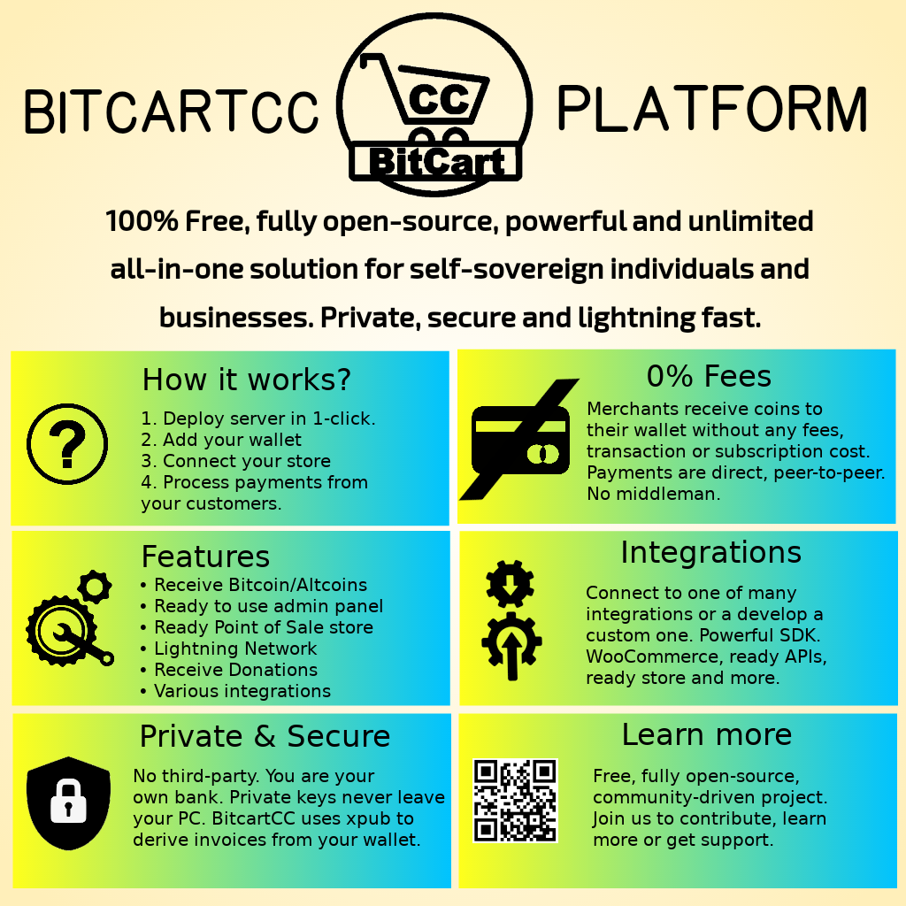

# Introduction

## Introduction

BitcartCC is an open-source, self-hosted all-in-one solution for Bitcoin and other cryptocurrencies.

If you have trouble using BitcartCC, consider joining the [communities listed on the official website](https://bitcartcc.com#community) to get help from BitcartCC community members. Only file [Github issue](https://github.com/MrNaif2018/bitcart/issues) for technical issues you can't resolve through other channels or feature requests you've validated with other members of community.

Please check out our [official website](https://bitcartcc.com), our [complete documentation](https://github.com/MrNaif2018/bitcart-docs) and FAQ for more details.

## Features 

* Direct, peer-to-peer Bitcoin and altcoin payments
* No transaction fees \(other than those for the crypto networks\)
* No processing fees
* No middleman
* No KYC
* User has complete control over private keys
* Enhanced privacy
* Enhanced security
* Self-hosted
* SegWit support
* Lightning Network support
* Opt-in Altcoin integrations
* Easy to use API and SDK
* Process payments for others
* Powerful ready to use admin panel
* Ready store to get your first customers
* Many integrations available
* Extendable the right way

## How it works

### In a nutshell 

In layman's terms, BitcartCC is a self-hosted and automated invoicing system. When checking out, the customer is presented with an invoice. Each time, a different address is tied to a particular invoice, so there is no address re-use. BitcartCC follows the status of the invoice through the blockchain and informs a merchant when he can fulfill the order safely. But BitcartCC is not limited to only that. You are provided with ready solutions for your store, your company or application. Anything is possible with BitcartCC.

### How is it different

BitcartCC is code, not a company. There is no third-party between a merchant and a customer. Merchant is always in full control of the funds. There are no processing or subscription fees. BitcartCC is free to use and completely open-source, so developers or security auditors can always inspect the quality of the code, users can find  bugs themselves and help us, other developers can extend and add new features to it.

### How it keeps funds secure 

Payments via BitcartCC are direct, peer to peer. The merchant receives the coins directly to their wallet, with no intermediary. Securing funds comes down to the merchant securing their own private keys, which is standard for most cryptocurrency wallets. BitcartCC uses the most secure and the fastest Electrum wallet that merchants can use to view funds received by paid invoices. The funds from that wallet can only be spent using the merchant's private key which is never required by BitcartCC itself. This allows merchants to have complete control of funds received.

### How it keeps data private 

The data is shared only between two parties - the buyer and a seller. Other payment processors share and collect user data with other parties, making it very hard to comply with privacy law regulations like GDPR. Each invoice in BitcartCC has a different receiving address, which means there is no address re-use which improves privacy significantly. No user or merchant data is collected, it uses only the data entered by merchants and users, with no data leaks between each sides.

### How it resists censorship 

* Self-hosted
* Can be run everywhere, from low-powered device like Raspberry Pi at home to enterprise-grade servers
* No third-party
* Can easily be re-deployed

BitcartCC does not have a central point of failure since nobody is controlling it except for the user running it. If run on the cloud server, the hosting providers can potentially censor users by suspending hosting accounts or disabling access to virtual machines. This is always a risk for anyone using a hosting provider. Since no private keys are stored on the server, a censored individual can easily re-deploy the BitcartCC with another host. Your coins are always inside your wallet. If an invoice is paid while your BitcartCC instance on the server is down, the software will automatically determine and notify the merchant of offline invoice payments when your server is back up. If a hosting provider suspends the server, and there was no proper backup, server settings and invoice data may be lost, but on-chain payments are always in your wallet. For ultimate censorship-resistance, users should run BitcartCC on their own hardware.

### Beyond payment processing 

BitcartCC is not only a payment processor for merchants. It is called all-in-one crypto solution because it can be used for anything you want. It abstracts a lot of complex components into simple and easy to use interfaces, APIs and SDKs. Developers can build entire businesses and projects on top of the stack. Enterprises can use it as scalable and secure back-end of their infrastracture without ever having to put a trust in a third-party. BitcartCC is a toolbox with lots of tools you can use, it's up to you how you want to use it.

### 

