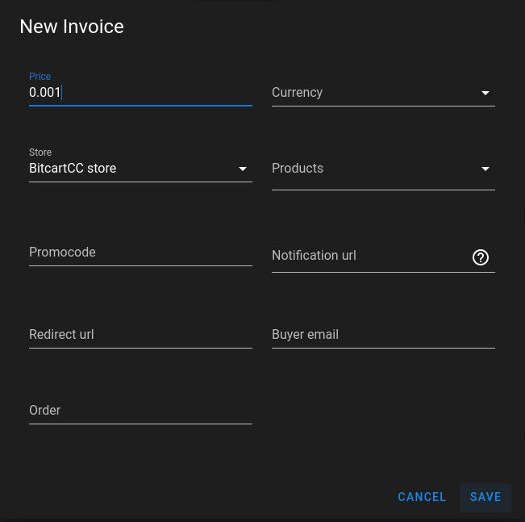

# Use Case

Built with extensibility in mind, BitcartCC  is a feature-rich software with plenty of use-cases that can solve problems for different types of users.

In this guide, we will show you some of the use-cases of BitcartCC, but it is by no means limited to the groups of users we mentioned.

So let's have a look at what you can do with BitcartCC and what the benefits are of using it.

## Merchants

By choosing BitcartCC to process payments, you are:

* Saving money \(no fees, no subscriptions\)
* Cutting out the middle-man \(Payments go directly to your wallet\)
* Enhancing privacy for you and your customers \(no address re-use, no IP leaks to third parties\)
* Saving time \(easy integration and installation\)
* Protecting yourself from interference in your business \(self-sovereignty\)
* Reducing the costs for the server running your instance \(lightweight but secure\)
* Decreasing the development time as we have ready solutions available for any kind of store

To enjoy most of these benefits, you don't even need to run a BitcartCC instance yourself, you could just create an account on someone else's instance. It will be even easier to set up for free or a fee depending on the host's choice. Downside is that you will rely on the server admin to keep it functional and up-to-date.

With the growth of your business it will eventually become important to set-up your own server to be really independent.

Want to give it a try? Here is an up-to-date list of [third-party hosts](https://docs.bitcartcc.com/deployment/thirdpartyhosting).

### Online Store

If you're a merchant running an e-commerce business, you can easily [deploy BitcartCC](https://docs.bitcartcc.com/deployment) and connect it to your store via [integration plugins](https://docs.bitcartcc.com/integrations/) in just a few clicks. Or, if you don't have a store yet, you can use BitcartCC's built-in store which is a ready solution which might be enough for your use case. You can start selling even without any programming!

BitcartCC checkout is no different to any other payment gateway. Your customer gets an invoice. They pay it by scanning a QR code or by copy-pasting the amount and the address. When their payment is confirmed, you will be notified via your e-commerce CMS and additional configured actions will be executed, and you can ship the item. Take a look at [our demo online store](https://store.bitcartcc.com).

### Physical Store

For physical stores, BitcartCC has a [web-based Point of Sale](https://store.bitcartcc.com) \(POS\) store which can be customized. Similarly to the online store, your customer is presented with an invoice that they can pay on the spot. You can create a watch-only wallet on your phone to be notified of the payments through the POS, without the need of any additional software. The POS store can be run on any web-connected device.

### Freelancers & Bill Pay 

Send anyone a request for payment by creating an invoice with custom amount in your admin panel \([demo](https://admin.bitcartcc.com)\). With or without expiry, users can pay the invoice at any time. 

Merchants or freelancers can use this for bill pay services. You can even use your admin panel to quickly request money from friends.

### Lightning Network payments 

No matter the kind of business you run, BitcartCC offers a very easy way to get started on the Lightning Network. You can use and experiment with this innovative second-layer solution build on top of Bitcoin by [following this guide](../guides/lightning.md). Both merchants and customers can use BitcartCC to receive or make payments off-chain with instant confirmations and neglectable network fees.

## Charities and Content Creators \(Donations\) 

Charities, non-profits, content creators, and other organizations that want to accept cryptocurrency donations in a more private way than the traditional single bitcoin address method can utilize the [Admin panel,](https://admin.bitcartcc.com) and [POS store](https://store.bitcartcc.com) for a better user experience.

Benefits of using BitcartCC for accepting donations:

* Saving money \(no fees, no subscriptions\)
* Cutting out the middle-man \(Payments go directly to your wallet\)
* Enhancing privacy for you and your customers \(no address re-use, no IP leaks to third parties\)

It is particularly important to mention that BitcartCC prevents address reuse, as many people has been reusing address for donations in the past. Here is why you SHOULD NOT reuse Bitcoin\(or any other cryptocurrency\) address:

* Privacy: reusing the same address for donations not only makes it incredibly easy to link it to your identity, it also compromises the privacy of your donators and every person that interacts with you
* Security: by compromising your privacy, address reuse increases your attack surface, as people that want to steal from you or harm you would have A LOT of information about you and your donators
* High fees: fees for a Bitcoin transaction are calculated according to the "size" of a transaction \(which has nothing to do with the amount being sent\). By reusing addresses, you are building huge transactions involving many inputs, that will cost you a lot in fees when you want to move them

You can read more about address reuse on the [Bitcoin Wiki](https://en.bitcoin.it/wiki/Address_reuse).

## Local Payment Processor 

When you deploy a self-hosted BitcartCC instance, you can attach and create an unlimited number of stores and apps. This means when you launch BitcartCC, you can become a payment processor for your family members, friends or your local community. You can do that to promote Bitcoin or other cryptocurrencies amongst people you know or to help out people that can't rely on other solutions.

While you're allowing them to rely on your BitcartCC core instance, the payments go directly to their wallets, and you have zero control over their funds at any point in the transaction, and cannot charge a processing fee. You can, however, develop a registration paywall and charge monthly fees.

Take a look at the list of [third-party hosts](https://docs.bitcartcc.com/deployment/thirdpartyhosting).

## Cryptocurrency Exchanges 

The number of merchants using BitcartCC grows each day, and cryptocurrency exchanges could benefit from it by developing integration with BitcartCC and allow instant conversion of cryptocurrency payments into local fiat currencies.

Being an open source project, BitcartCC doesn't have the power to impose anything on exchanges, meaning that any of them could build on top of it, regardless of their size or the country they operate.

## Hosting Providers 

Hosting providers can \(and some already did\) create easy 1-click BitcartCC deployment solutions for their customers. With the growing interest in BitcartCC, hosting companies can tap into this source of new customers and make money by hosting easily-deployable BitcartCC instances for merchants.

## Developers

BitcartCC community is amiable and open-minded. Developers can not only learn a lot and get their name out by working on an open-source project, but also participate in transforming the payment processing business.

BitcartCC source code is a great source of learning, as it utilizes the modern and demanded tech stack. It has already helped many people in learning something: testing and TDD, docker, APIs building, and many more! Join us and discover many great things in tech world!

These are some of the many ways in which you can use BitcartCC. Unleash your creativity and feel free to build your own solutions to solve problems.

