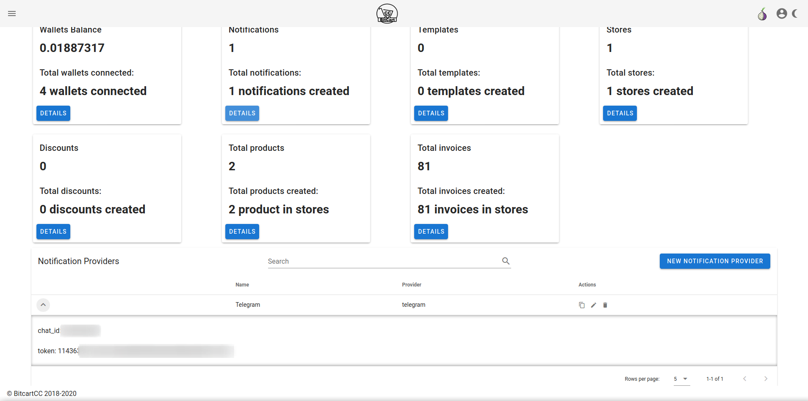
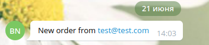
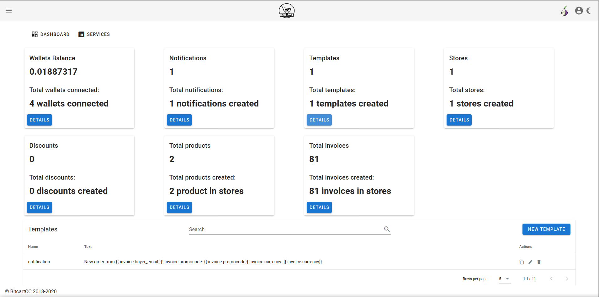
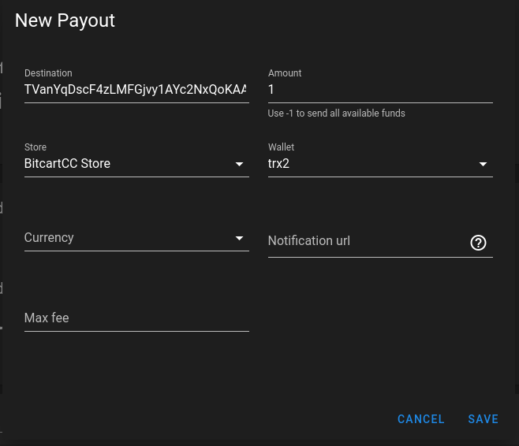
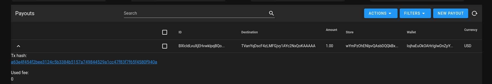
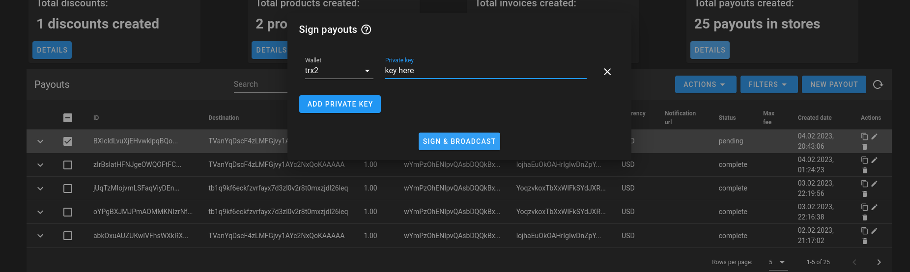

# Walkthrough

In this article, we will walk you through the Bitcart admin panel user interface and show you how to navigate through different options.

When creating an account, if you're the first user registered on the instance, you'll be granted superuser rights (full control over the server). On third-party hosts it is usually not so, but if you're hosting your own instance you'll of course become the full owner of it.

After you created the account on the Bitcart instance hosted by yourself or a third-party, you'll see a lot of information cards.

Note about the night mode of the panel. By default, admin panel uses day mode, but if in your local time it is from 8 pm to 6 am, night mode will be enabled automatically 😉 You can configure it by clicking the moon icon in the top right corner of the page.

Each information card contains summary about something in your account: wallets, stores, products, invoices, etc.

By clicking Details button in any of the cards you will be able to see full information about specific unit.

Note, wallets balance is displayed not in BTC, but in abstract currency. It is a sum of all your balances in different currencies.

If you're a superuser, you can click on profile icon in the top right corner of the page to visit server settings page.

From server settings page, you can control the users of your server, and many more. For more information, check [Server Settings FAQ](../support-and-community/faq/server-settings-faq.md)

Now, to the other common settings.

Each page basically contains one common thing - a datatable.

It is a feature-rich datatable, supporting searching, ordering, create/edit/delete actions, batch actions, and some additional actions depending on what page you're on. For example, on stores page, you can configure email settings for a store by clicking email icon in actions column.

## Wallets

The core of Bitcart is creating a wallet. In Bitcart, one wallet represents one currency.

Default currency is btc, you can change that. When creating wallet, just select currency code from the ones available on your instance (btc,ltc etc.). Wallets may have a name and their [xpub](../support-and-community/faq/terminology-faq.md#what-is-an-xpub).

The nice feature of Bitcart is that it does not require your private keys, but it supports many different formats.

You can enter (x/y/z)pub - public key, (x/y/z)prv - private key, or even electrum seed - providing easiest migration possible from many wallets, especially electrum. If you don't have an xpub yet, we recommend you create a wallet somewhere. [Electrum](https://electrum.org) wallet provides the best integration with Bitcart, check [Architecture page](../development/architecture.md) for more information.

When creating a wallet, it will get synced very fast (depends on the size of the wallet, but shouldn't take too long), and Bitcart will fetch it's balance and display it.

By clicking arrow near any of the rows, you can view some additional details, like wallet xpub.

## Stores

You can create unlimited amount of stores in Bitcart.

Each store can contain any amount of products and associated invoices. Store is a base entrypoint for anything related to checkout.

Store may have multiple wallets connected. That way, connecting different wallets with different base currencies, you can achieve multicurrency checkout.

Selecting multiple wallets of the same currency is **NOT** recommended. On invoice creation, Bitcart will pick the first wallet of that currency, returned by database(they might be returned in any order).

.png>)

If you want to send customers invoices on successful checkout, you should configure email server.

To do that, click on email icon in actions column, and enter SMTP server details.

Store email is the email used to send messages from, and the display email in Bitcart POS store.

Email host, port, login and password are credentials for your SMTP server. Email host shouldn't include any http:// or https:// parts. If your SMTP server requires TLS, turn on SSL/TLS switch.

When done(you should click save button first), click on Test ping button to see if your setup is working.

Note for gmail SMTP servers, you should enable access by turning on [less secure apps](https://myaccount.google.com/lesssecureapps) (it is still secure, gmail apps aren't the requirement). You might also need to [allow access](https://accounts.google.com/DisplayUnlockCaptcha) on a new account.

From the email settings pop-up, you will also be able to load a ready preset for some popular email server providers.

Your store is the main configuration point for all the further actions with it, like invoice creation.

You can configure different policies from your store settings.

### Store checkout settings

By clicking on settings icon, you will be presented with the store checkout settings pop-up, where you can change different settings affecting the checkout.

* Invoice expiration time, in minutes. It affects the timer displayed in the checkout. It is the time in which the customer must send the payment, otherwise invoice is marked as expired
* Use HTML templates - whether to render templates of email message sent to customer as html or as plain text. For more information, see this [guide](../guides/templates.md#html-templates).

## Discounts

It is optional page for your initial setup, you may skip it for now.

In many cases you might want to add some discounts to your store. New year discounts, other holidays? Limited time promocode discounts? Discount when paying in your preferred currency? Anything is possible with Bitcart.

Just provide a percent(integer) for your discount, and discount apply conditions:

* promocode(optional, when not provided discount is always applied when other conditions succeed)
* end date
* currencies(comma separated list of currency to apply to, or empty to apply to all currencies)

You can link discounts to products in the products page.

When one invoice at creation time has matched multiple discounts, Bitcart will pick the best discount(by percent).

.png>)

.png>)

## Products

Products are your base selling unit. Create your products, link them to your stores, add product details - and they will get displayed in your store POS!

Bitcart supports many different information for creating products:

* Amount, displayed in store POS in USD
* quantity(how many products of the same kind available)
* product category(used for filtering in store POS to classify your products)
* Discounts applied to the product(see previous section)
* Product status(like in stock, not available, up to you)
* Download url(for digital content, will be sent to customer in email)
* Store, from which to take wallets and other information
* Date of creation(auto-filled)
* Product image(supports cropping, rotating and many more!)
* Product description

## Invoices

This page can be used to monitor your paid invoices, create new invoices and send them to friends, or to pay an invoice.

Supported information:

* Price is the price in store's default currency, which will be converted to payment method's currency when generating payment URL
* Currency, used to override store's default currency if needed
* Store, from which to take wallets and other information
* Connected products(for store POS, optional)
* Promocode, if customer entered it during checkout process (auto-filled)
* Notification URL where to send IPN notifications on invoice status change (more below)
* Redirect URL, customer will be redirected to it after successful checkout.
* Buyer email, if customer entered it during checkout process(auto-filled)
* Order ID, used by external integrations like woocommerce, track your orders by searching for order id(auto-filled)
* Discount - ID of the discount applied during invoice creation(auto-filled)
* Invoice status, more below
* Date of creation (auto-filled)
* Payment methods - not editable fields, displaying checkout information

If your invoice contains connected products, you'll be able to know which products were bought by the customer. The name of the store will be used on checkout.

When converting to payment method's currency, destination currency's maximum decimal points is taken in mind, and the price is being formatted as per currency settings. The convert, the exchange rate is used. See this [page](../guides/fiat-currencies-support.md) for more information.

### Notification URL

If you fill in notification URL, Bitcart instance will send IPN notifications to that URL via a POST request.

It will send the following json data:

`{"id": invoice_id, "status": new_status}`

When invoice status changes(Pending->complete, Pending->expired, etc.), notification will be sent.

It's up to you how to process that IPN notification. You should also verify that data sent is correct, as theoretically, anyone can send that POST request if they know your IPN handler URL. So, check that sent status is the same as the one got from get invoice request.

Invoices statuses can be one of the following:

* Pending (in progress)
* complete (invoice paid)
* invalid (unexpected error)
* expired
* In progress (lightning network status)
* Failed (lightning network status)

After invoice creation, you'll be able to view checkout information by clicking show button in payment methods column. It will display a so-called "invoice preview", it is not a fully functional checkout, but just an information dialog to display payment methods(it ignores invoice status).

By clicking open checkout you'll be redirected to full checkout, respecting invoice statuses and other things. Invoice URL can be safely shared with others and used for checkout right from your admin panel.

.png>)

.png>)

## Notification providers

On this page you can configure your notification providers, to later connect them to your stores.

Supported information:

* Notification provider name for display
* Provider to use, you can choose of many available ones
* Provider options, differing from provider to provider

Each notification provider has different settings. Refer to their documentation about how to get certain settings. After that, select needed provider, fill in the settings and save changes.

Then you can reuse notification providers by connecting them to needed stores!

When notification provider is connected, on each successful order it will be run to deliver a notification to you.

## Templates

On templates page you can override global server templates, or create custom ones.

Available fields:

* Name of template, you can select from built-in ones or type in a new one
* Template text

All templates in Bitcart are rendered via [Jinja2](https://jinja.palletsprojects.com/en/stable).

Read about it's syntax in their [template designer documentation](https://jinja.palletsprojects.com/en/stable/templates).

Read more about example usages of templates in Bitcart [here](../guides/templates.md)

### Template selection rules

When a template is being requested to render (for example, when sending notification via notification providers, or composing email message), it is selected in the following order:

1. If this product or store has template connected, it will be used
2. If it has no template connected, default global store or product template will be used (named store or product), if exists
3. If none of templates above are customized, [default templates](https://github.com/bitcart/bitcart/tree/master/api/templates) are used

### Changing object's templates

On some pages, for example, stores or products pages, you will be able to edit templates per each item (per each product, per each store, etc.)\
If so, on such pages you will see the following icon:

By clicking on it, you will be able to override default templates for this item. Such templates are always used the first if they are set.

Note that in the example image above it is not necessary to connect default templates for each store, as the template we created is named notification, therefore overriding default ones for each store.

## Payouts

Bitcart supports sending funds from your connected wallets to outside sources. This can be useful for refunds for example, or in case you don't want to open a separate wallet for each currency and use universal Bitcart interface.

<figure><figcaption>
Create payout dialog
</figcaption></figure>

Just enter:

* Destination
* Amount to send (in fiat currency, defaults to default currency of the store, for this screenshot it would be 1 USD)
* Store to use (used for setting some defaults like currency)
* Wallet to send from. Whether it's a smart contract or not will automatically be determined via wallet settings
* (Optional) notification url where to send IPN notifications on payout status updates (a HTTP POST request with data in format `{"id": "payout id", "status": "new status"}`
* (Optional) Maximum fee (in fiat currency selected). If predicted fee exceeds the max fee, the payout will halt.

When saving a payout, it won't be sent automatically. It will be set to pending status, waiting for your approval. There are a few statuses for you to use:

pending (just created), approved (manual approval by you, not sent yet), cancelled (manual cancel by you, not sent), sent (payout is sent, tx hash is available, transaction not confirmed yet), complete (payout is sent and confirmed, used fee is available in payout details), failed (something failed during payout sending)

<figure><figcaption>
Payout details after it is complete (note: tron blockchain actually allows free transactions)
</figcaption></figure>

### Signing payouts

By default, all wallets in Bitcart are watch-only. We typically only require an address or xpub for payment processing needs. Private key is never required. In case you use the payouts feature, you will be able to connect relevant wallets used with their private keys. Signing will be done in a special "diskless" mode, where all operations will be performed in memory, with no data saved to disk.

But in case your wallet was created as a hot wallet, it will be used automatically without the need to supply it (note that in this case, as per regular wallet loading operations, the keys will be saved on disk)

<figure><figcaption>
Sign payout dialog
</figcaption></figure>
