# Configurator

Bitcart Configurator allows you to easily deploy new Bitcart instances, or re-configuring existing ones, with ease and no technical skills.

Configurator demo is accessible at https://configurator.bitcart.ai

You can access it from your admin by clicking the configurator button.

It allows you to easily deploy a new instance by just answering a few questions.




Configurator is designed for ease of onboarding and works only with [one domain mode](../guides/one-domain-mode.md).

If you have more complex setup, check out full [docker deployment guide](docker.md).


## Deployment destination

There are 3 deployment destinations available: remote, manual, and current instance.

### Remote

By entering the server credentials, the Configurator will automagically connect to your server and deploy the instance, while you drink a cup of coffee!

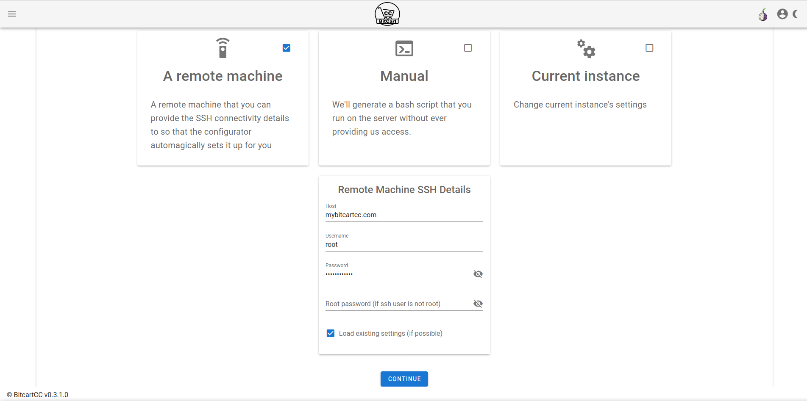

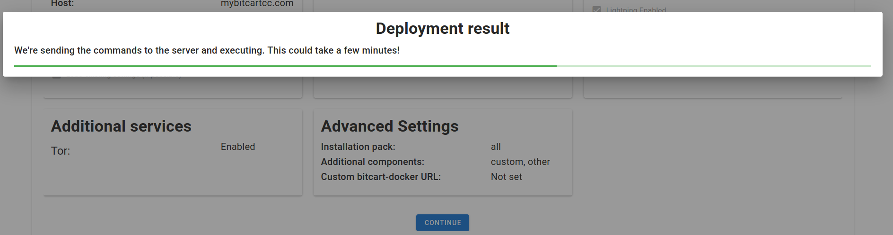

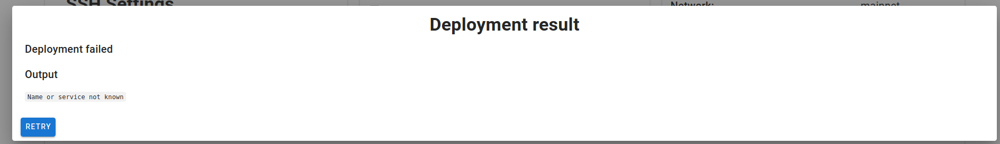

For an example of successful deployment, watch the video above.

### Manual

If you don't trust the configurator's server, or you just need a copiable script you can run yourself, you can use the manual mode. It generates a script for you to copy, based on selected settings.

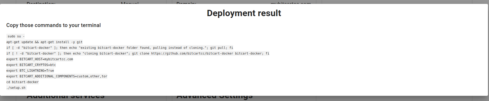

### Current instance

If you are the server admin, you will have access to the current instance mode. You can change settings of your current instance without logging in to your server. By clicking current instance button Bitcart loads all current settings which you can customize.

## Domains

On this page you can enter your domain where to deploy (using [one domain mode](../guides/one-domain-mode.md)), and optionally disable https support. If you don't have a domain, you can enable tor support in the later pages.

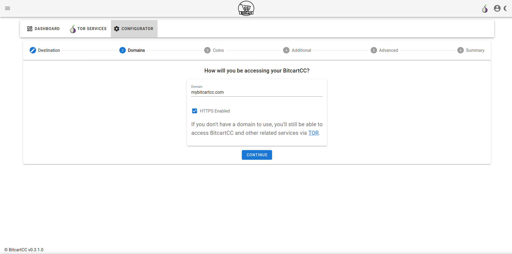

## Coins

On this page you can configure and enable all the coins you want. For each coin you may enable lightning with just one click, or change network settings. Note that you must select at least one coin.

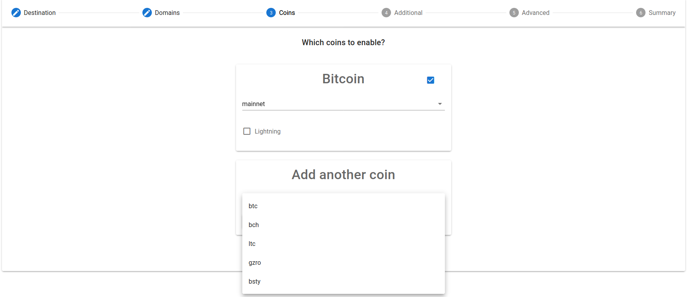

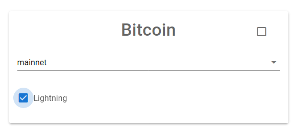

## Additional

On the additional page, you may enable additional plugin packs, for example, Tor support.

## Advanced

On this page you can configure advanced parameters. If you don't need to edit them, skip to the next page.

You can choose an installation pack (all, backend, frontend or none), and add more custom components, or edit the bitcart-docker repository URL.

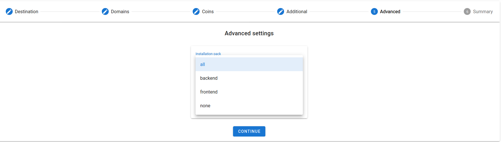

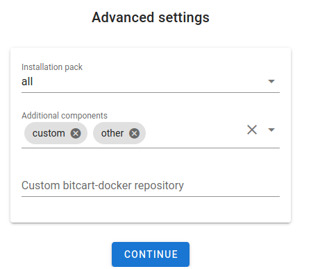

## Summary

On this page you can preview settings used. If something is wrong, you will see warnings.

When you are ready, click continue.

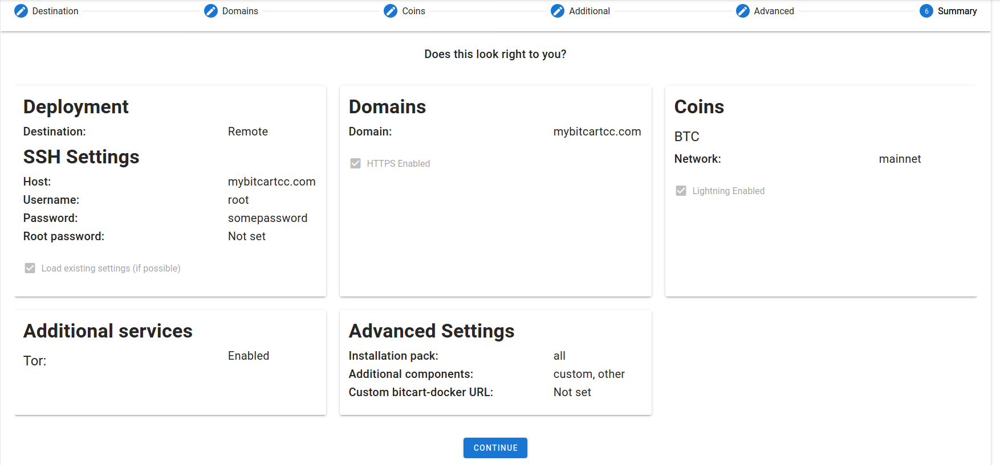

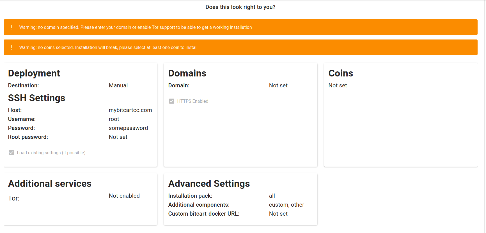

## Deploy stage

After clicking continue, you will either see a ready script, or a progress bar, while configurator is deploying a new instance. Refer to each deployment destination for more details.
