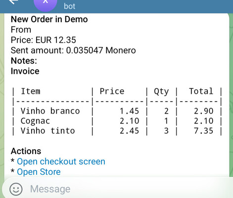

# Templates

Templates are a powerful way to customize your store's checkout flow.

Please read the [templates guide](../guides/templates.md) first.

Here are some examples of ready templates.

As plain text templates are pretty simple, we show complex html examples. Ensure to enable [html template rendering](../guides/templates.md#html-templates).

**Note**: the templates contain a lot of boilerplate code to workaround different email clients rendering issues. All examples are self-contained and are ready to be used in production.

They were generated by this [email template generator](https://emailbuilder.top) and modified to be actual templates.

## Simple summary table


This template is just a simple example of how to use html in your templates for better design. This example utilizes a table with some custom styles to display bought items.



`product.html` is the template that renders each individual product.

We use some of the available variables to show the product price, quantity selected, and final calculated price. `store.default_currency` can be used to get product's currency.

And in `shop.html` template (containing most of the design), we just use:

```

{{product}}

```

To include all products' rendered templates.

And we also use `{{store.name}}` to display store name at the top.

## HTML notification template

The following HTML template produces a nice summary to the recipient whenever a new order is placed. It can be used 
anywhere notification templates are supported, but this example is especially suitable for Telegram or other 
instant-messaging notification services.



### Tips and gotchas

* Ensure that you _escape_ all input -- *especially* user-provided input like email addresses, notes, and shipping 
  addresses. You do this by using the `escape` filter, e.g. `{{ invoice.buyer_email|escape }}`.
* To use this template as a notification template, you need to ensure that HTML rendering is supported by your notification 
  provider. Telegram supports HTML formatting in messages, [for example](../guides/telegram_notifications.md).

```html
<b>New Order in {{ store.name|escape }}</b>

From {{ invoice.buyer_email|escape }}
Price: {{ invoice.currency }} {{ invoice.price|format_decimal("price") }}
Sent amount: {{ invoice.sent_amount|round(6) }} {{ invoice.paid_currency }}


* Promo: {{ invoice.promocode|escape }}


* Discount: {{ invoice.discount }}


* Deliver to: 
{{ invoice.shipping_address|escape }}


<b>Notes:</b>
{{ invoice.notes|escape }}


<b>Invoice</b>
<code>
| Item          | Price    | Qty |  Total |
|---------------|----------|-----|--------|


{{ "| %-14s| %8.2f | %3.0f | %6.2f |"|format(product.name,product.price,q,product.price*q) }}

</code>


<b>Actions</b>
* <a href="https://my_store.xyz/admin/i/{{ invoice.id }}">Open checkout screen</a>
* <a href="https://my_store.xyz/store/{{ store.id }}">Open Store</a>

<b>Details</b>
* Status: {{  invoice.status }}

```
