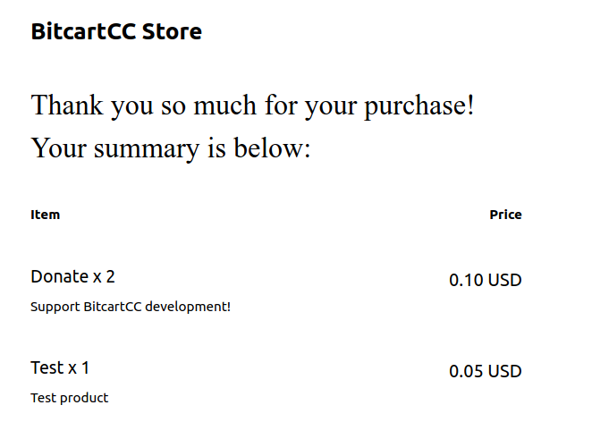

# Templates

Templates are a powerful way to customize your store's checkout flow.

Please read the [templates guide](../guides/templates.md) first.

Here are some examples of ready templates.

As plain text templates are pretty simple, we show complex html examples. Ensure to enable [html template rendering](../guides/templates.md#html-templates).

**Note**: the templates contain a lot of boilerplate code to workaround different email clients rendering issues. All examples are self-contained and are ready to be used in production.

They were generated by this [email template generator](https://emailbuilder.top) and modified to be actual templates.

## Simple summary table



This template is just a simple example of how to use html in your templates for better design. This example utilizes a table with some custom styles to display bought items.



`product.html` is the template that renders each individual product.

We use some of the available variables to show the product price, quantity selected, and final calculated price. `store.default_currency` can be used to get product's currency.

And in `shop.html` template (containing most of the design), we just use:

```

{{product}}

```

To include all products' rendered templates.

And we also use `{{store.name}}` to display store name at the top.
