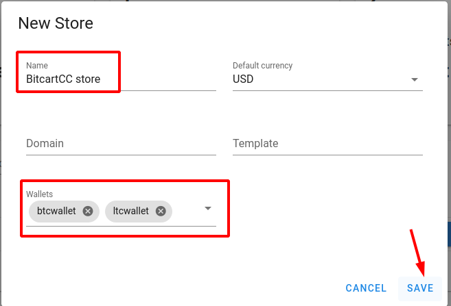

# \(3\) Create a store

## Creating a Store in BitcartCC 

Inside BitcartCC, you can create and manage an unlimited number of stores. Each store has its own wallet or wallets\(it allows multicurrency checkout\), can create products, invoices or be connected with external e-commerce software through one of the integrations.

To create a store, make sure you're logged in into your account, and go to &gt; **Stores** page by clicking on **Details** in it's card. Click on the **New Store** button. Enter the store name, and select this store's wallets.

## Customizing your BitcartCC Store Settings 

You can always edit your store by clicking the edit icon.

To configure email servers, click on email icon in actions column. 

For more information, check Stores FAQ.

_**Proceed to the next step -**_ [_**What's Next?**_](whatsnext.md)_**.**_

