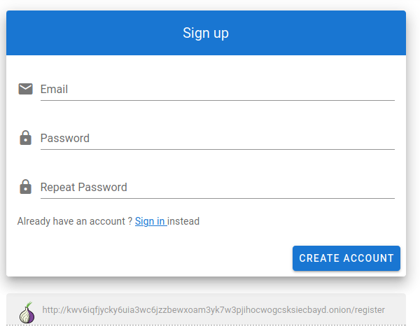

# \(1\) Register account

The first step in setting up your BitcartCC instance is creating a user account. The **first created account** on a newly-deployed BitcartCC instance is automatically - **admin**.

Server admins have the same access to features as the regular users, but they are also provided with some [server management tools](../guides/server-management-settings.md), like server upgrade or server policies management.

To register, visit your BitcartCC URL and fill in the account registration form. Input your password, password confirmation, e-mail and click "Register". You will automatically be logged in. 

_**Proceed to the next step -**_ [_**Creating a wallet**_](createwallet/)_**.**_

