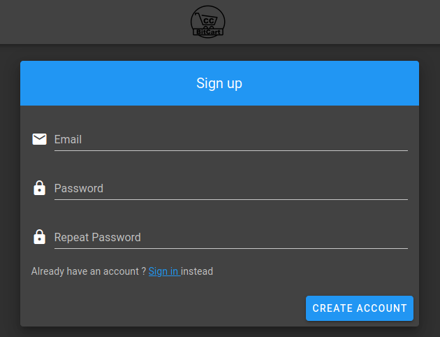

# \(1\) Register account

The first step in setting up your BitcartCC instance is creating a user account. The **first created account** on a newly-deployed BitcartCC instance is automatically - **admin**.

To register, visit your BitcartCC URL and fill in the account registration form on the right. Input your password, password confirmation, e-mail and click "Register". You will automatically be logged in. 

_**Proceed to the next step -**_ [_**Creating a wallet**_](createwallet/)_**.**_

