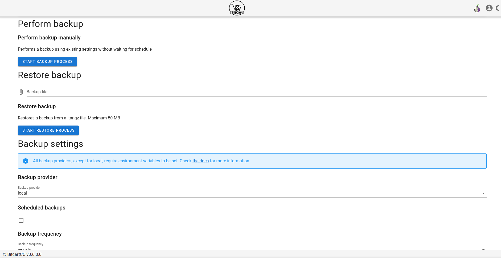
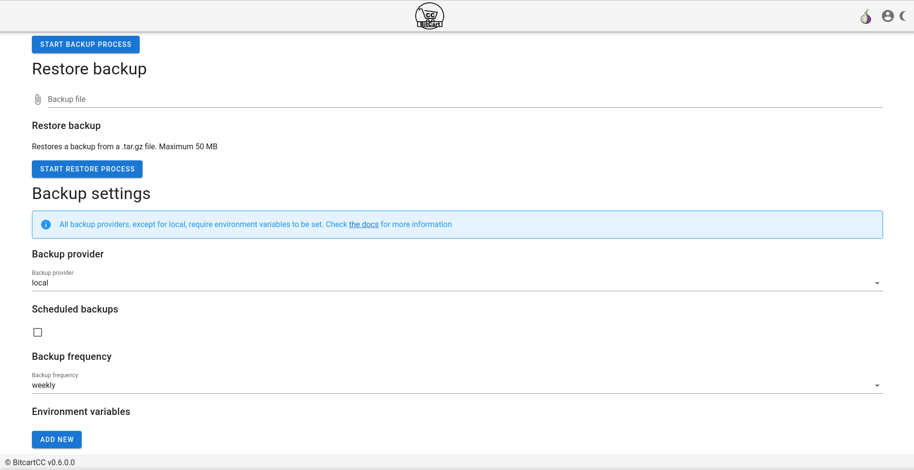
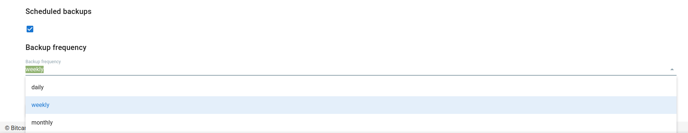
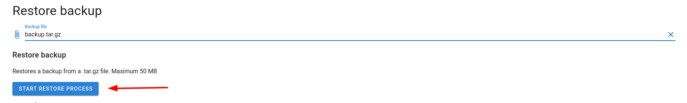

# Backups

BitcartCC supports backing up it's data on one server and restoring it on another.

It is available via both UI and terminal.

## Backups management from admin panel

To enter backups management page, go to profile-&gt;server management-&gt;backups





From there you can start a backup right away, it uses settings from this page to do it.

### Backup settings

You can select which backup provider to use. All of them, except for local, require setting environment variables as you can see on the screen above.

#### Local

Local provider just saves the backup on your current machine.

It is saved to `/var/lib/docker/volumes/backup_datadir/_data/` 

Backups are named `YYYYMMDD-HHMMSS-backup.tar.gz`

#### SCP

SCP provider copies the file from your server to `SCP_TARGET` and deletes backup locally

Required settings:

* SCP\_TARGET: for example `username@ip/where/to/put/backups`

#### S3

S3 provider sends your file to amazon S3 and then deletes it locally

Required settings:

* S3\_BUCKET: in which bucket to save the backup
* S3\_PATH: where exactly in the bucket to save the backup

### Scheduling backups

It is possible schedule backups to run automatically.



For backups to work, your settings must be valid \(otherwise it will just fail every time\), and you need to tick the scheduled backups checkbox. The timer will be saved even after server restarts.


Settings are saved automatically, and if you had existing schedule configured and change frequency/turn off and then on again backups, the timer will be reset



We assume that daily is exactly every day, weekly is every 7 days, monthly is every 30 days


### Restoring backups



Restoring backups is as easy as just uploading backup file to your instance!

## Backups management from terminal

### Creating backups

Backup settings are configured via environment variables

If you need to run backup for scp provider, you would run:

```text
BACKUP_PROVIDER=scp SCP_TARGET=user@ip:backups ./backup.sh
```

### Restoring backups

Assuming that your file is named `backup.tar.gz`, just run:

```text
./restore.sh backup.tar.gz
```

