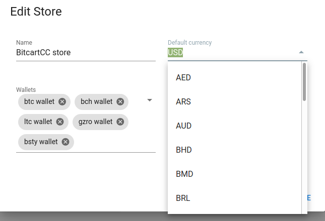
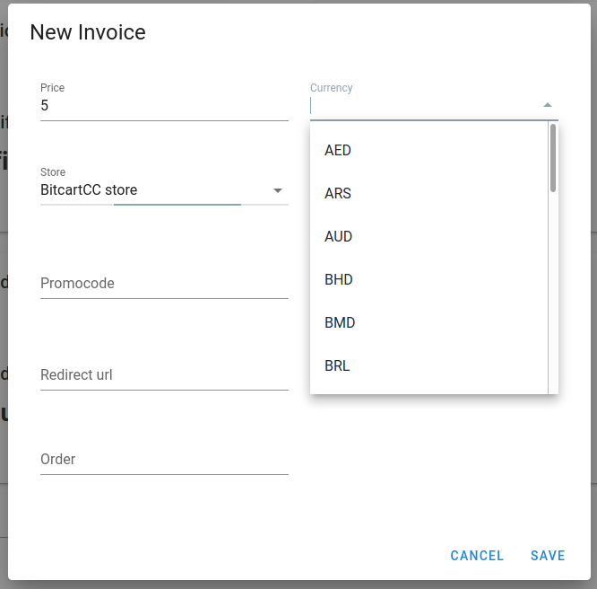

# Fiat currencies support

BitcartCC supports automatic conversion from fiat currencies to payment method's currency upon invoice creation.

It is done via cached pre-fetched exchange rates, got from configured provider.

The default fiat currency used for prices is USD.

The default exchange rate provider is CoinGecko, as it provides a big list of fiat currencies to select from, as well as the historical rates, plus it is free of charge and has generous limits.

BitcartCC's default exchange rate is the same as Electrum's one.

All the exchange rate providers available in Electrum are also available in BitcartCC.

## Fiat currencies in the admin panel

To change fiat currency used in your store, change it's default currency field:



Store default currency is the one displayed in the [Store POS](store-pos.md), and the one used by default for invoice creation.

You can override invoice default currency when creating it:



## Changing the exchange rate provider

Currently, you can configure the exchange rate provider only via an environment variable passed to the daemon, and it is not accessible in the docker deployment. We want to improve that in the future.

Set the `COIN_FIAT_EXCHANGE` variable to the name of exchange you want to use, like so:

```bash
BTC_FIAT_EXCHANGE=CoinDesk python3 daemons/btc.py
```

