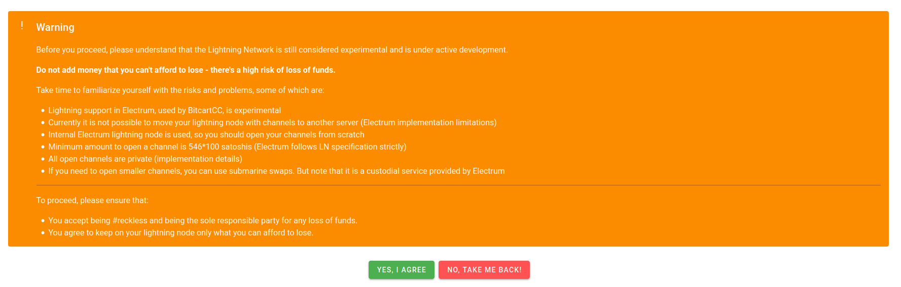
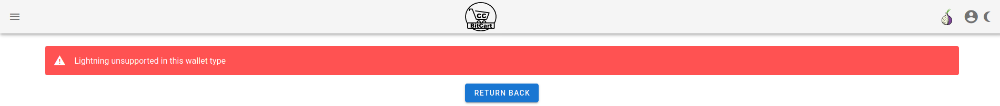
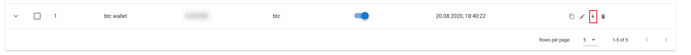
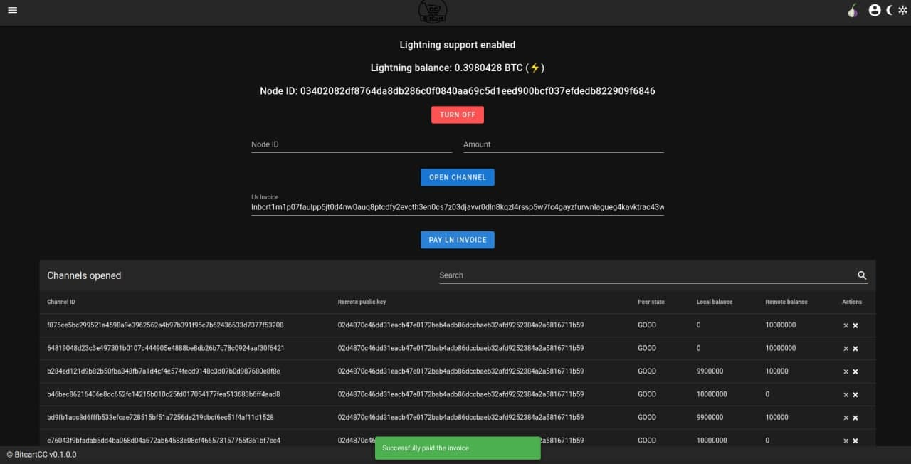
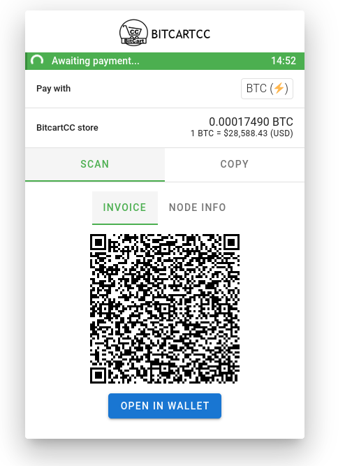
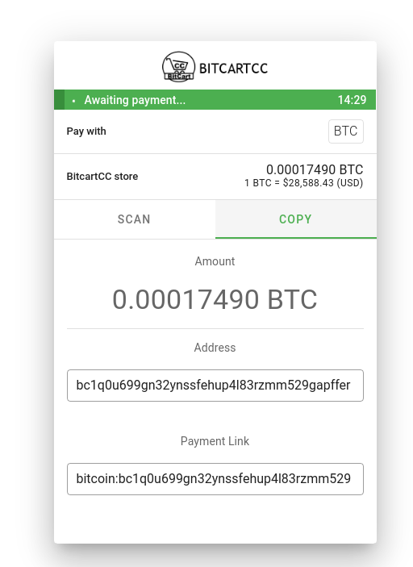

# Lightning Network


Lightning network support is experimental, as the lightning network itself.

Process with caution, and don't put large amounts in your lightning channels.

Before enabling lightning, please read all the warnings.


Lightning network in BitcartCC is supported via Electrum's lightning network implementation

It has some limitations, please read the most up-to-date version at your admin panel.



To enable lightning network, for each coin, run:

```bash
export COIN_LIGHTNING=true
```

Where `COIN` is coin symbol \(i.e. `BTC`, `LTC`\)

Note that it will utilize a bit more server resources, but not by much.

When enabled, you will be able to enable lightning on the wallets page.

Currently lightning is only supported in the native segwit wallets.

When opening a non-supported wallet \(or if lightning is disabled in the daemon\), you will see the following page:



If lightning is supported, by clicking on the lightning icon and accepting all warnings, it will be enabled for the wallet.

If lightning is enabled for a wallet, then, along with the regular coin payment method, a lightning one will be created.

As your BitcartCC daemons are standalone lightning nodes, you will need to open lightning channels from scratch. You can use the lightning management page for this

## Lightning management





From the lightning management page, you will see your lightning balance, your node id, list of open channels, and you will be able to close, force-close or open new channels.

You can also pay lightning invoices from that page via your node.

## Lightning checkout

From the checkout page, customers will be able to scan either the lightning invoice, or your node id.

That way they can open a channel with you





