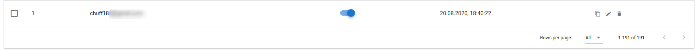
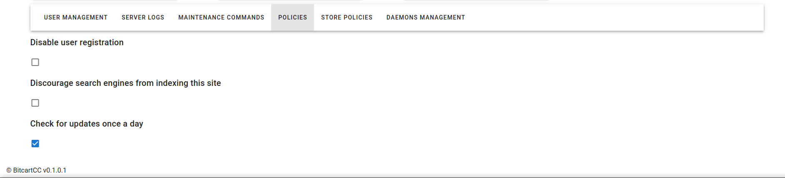

# Server management settings

BitcartCC has a few server management settings available.

They are accessible only by the superusers.

Superusers are the users of the instance with admin privilegies.

The first registered user is the super user, then they can add new ones from server management settings.

The server management settings don't leak the privacy of other users, super users can't view other users stores or wallets.

If you are the super user, you will be able to enter the settings by clicking on the profile icon->server management settings

## User management

From the user management page, you will be able to view all users registered on your instance, create new users or delete existing ones. Also, you can change a user's password and optionally make someone a superuser.

Note that, when editing user, it is not possible to view their existing password.

It is because, BitcartCC is secure and doesn't store plain text passwords. Only hashed passwords are stored.

You can click on the switch to make someone a superuser or make someone a regular user instead.

**IMPORTANT:** do **NOT** switch your own user, it will make you loose the superuser rights. The only way to recover will be via the database. It will be disallowed in the future versions of admin panel to avoid confusion.

## Server logs

From the server logs page, you will be able to check server logs.

The logs are ordered by their date-the latest log displayed the first.

Logs are aggregated by day.

It is possible to delete logs (except for the today's log, as it is used by the instance).

You can also download the log, to send it for troubleshooting purposes for example.

## Maintenance commands

From the maintenance commands page, you can execute common actions-upgrade your server or clean up it.

### Update the server

It will start the update process. During it your instance might be unavailable, and the page won't automatically reload after the update.

The update process will upgrade the cloned `bitcart-docker` repository, upgrade the docker-compose generator image, generate new configuration file from saved settings (from `.env` file), upgrade all the used docker images, recreate the modified containers and clean up the now unused images

### Restart the server

It will start the restart process. During restart your instance might be unavailable. Use restart feature to fix some possible bugs, if you met some.

### Cleanup the server

The cleanup process will do two actions: [cleanup unused images](server-management-settings.md#cleanup-unused-images) and [cleanup logs](server-management-settings.md#cleanup-logs).

See more below

### Cleanup unused images

This process does the same as after upgrade-cleans up all unused bitcartcc images from previous upgrades

### Cleanup logs

This command deletes all logs except for the currently used one.

## Policies

The policies allow you to control some server-wide important settings.

### Disable user registration

If you check this on, users will not be able to register on your instance. Register link will be removed from the login page, register page will not be accessible and the API will discard any register attempts. Turn it off to enable registration back.

### Discourage search engines from indexing this site

By enabling this setting, your instance will tell the search engines to stop indexing your site. It should disappear from search results. Note that it might not work with some search engines.

### Check for updates once a day

When enabled, your instance will check github for new BitcartCC releases, and display a notification in the admin panel that a new update is available.

### Allow access to configurator for unauthorized users

By default it is on. When enabled, users can access `https://admin.yourbitcartcc.com/configurator`, and deploy their instance from there via the [Configurator](../deployment/configurator.md).

## Store policies

.png>)

On the store policies page, you are able to configure some settings related to all the stores on the server or the [Store POS](store-pos.md)

### ID of the store to enable on POS

Enter the id of the store that will be displayed by the store POS. It will display this store's products and use this store's settings.

### Require email on POS checkout

By default it is on. When enabled, users must enter their email on store POS to continue to checkout, otherwise they can continue without email.

## Daemons management

This page is purely informational. You will see a list of connected daemons and some of their settings.
