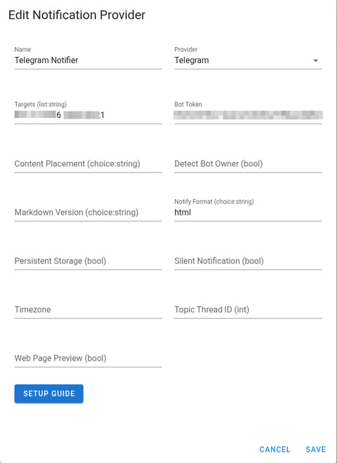

# Telegram notifications

Bitcart makes use of the [Apprise](https://github.com/caronc/apprise) API to deliver notifications to Telegram.

To integrate Telegram with Bitcart, you by-and-large follow the procedure outlined in the 
[Setup Guide](https://github.com/caronc/apprise/wiki/Notify_telegram). However, there are few recommendations and 
gotchas.

## Multiple recipients

You can deliver the notifications to multiple telegram users by providing multiple chat ids, separated by spaces.
 
## Markdown templates

Due to a [bug](https://github.com/caronc/apprise/issues/1178#issuecomment-2269802339), if you select `markdown`  as
the template format, you should leave the `markdown version` field blank, or set it to `1`.
Contrary to the apprise documentation, specifying `2` or `v2` here will result in messages not being delivered.

Telegram only supports a subset of markdown. It pays to read the 
[Telegram docs](https://core.telegram.org/api/entities#allowed-entities) to see what's supported. 

If there are any mistakes, the message gets rendered as text (at best), or (usually) apprise rejects the 
notification with a "bad parse" error. This is true of user input too. If promo code is `FREE_STUFF`, the underscore 
is interpreted as the start of italics and will break all the formatting. 

For this reason, you *must* escape all input in your templates, especially user-provided input like email addresses, 
notes, and shipping addresses. Alas, there isn't built-in support for this in Markdown templates, so you will need 
to manually escape any such input using the `replace` filter, e.g. `{{ invoice.buyer_email|replace("_", "\\_") }}`.

The bad news is that you have to manually replace every troublesome character, including: `_`, `*`, `[`, and `]`.

Therefore, you're doing anything but the simplest of reports, it's *highly* recommended to just switch HTML templates 
over Markdown.

## HTML templates

For more complicated notifications, prefer HTML templates. Again, Telegram has limited support for HTML, but the 
Jinja templating engine has better support for escaping HTML entities.

See [the HTML notification template example](../examples/templates.md#html-notification-template) for a working example.