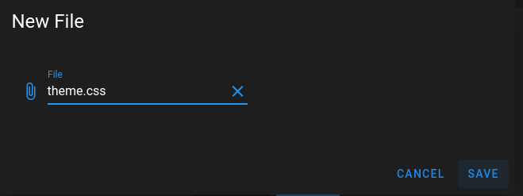
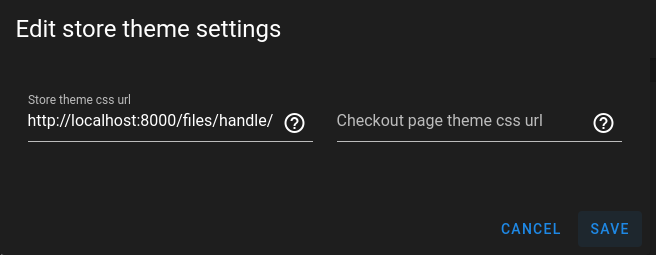
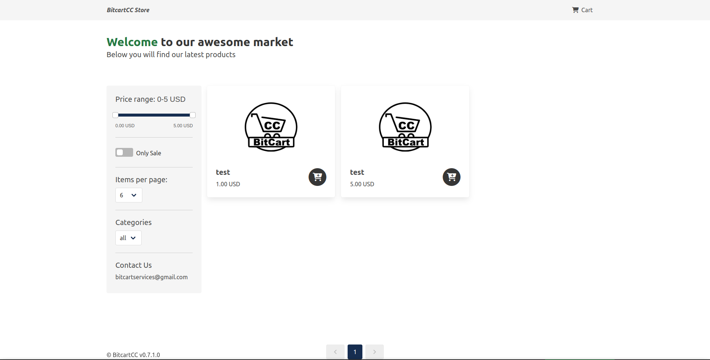

# Themes

It is possible to customize the look and feel of Bitcart UI by overriding some CSS variables.

Currently it is supported for store POS only.

A list of possible css variables: [https://github.com/bitcart/bitcart-store/blob/master/assets/bulma-generated/generated-bulma-vars.sass](https://github.com/bitcart/bitcart-store/blob/master/assets/bulma-generated/generated-bulma-vars.sass)

Guide to customizing the theme:

1. Create a css file changing some theme variables


```css
:root {
  --brand-color: #162d50;
  --primary: var(--brand-color) !important;
  --success: var(--brand-color) !important;
  --link: var(--brand-color) !important;
}
```


2. Upload theme file to file storage of your instance

<figure><figcaption></figcaption></figure>

3. Copy download URL and use it in store theme URL setting in stores page

<figure><figcaption></figcaption></figure>

4. Enjoy updated theme colors!

<figure><figcaption><p>New colors applied</p></figcaption></figure>
