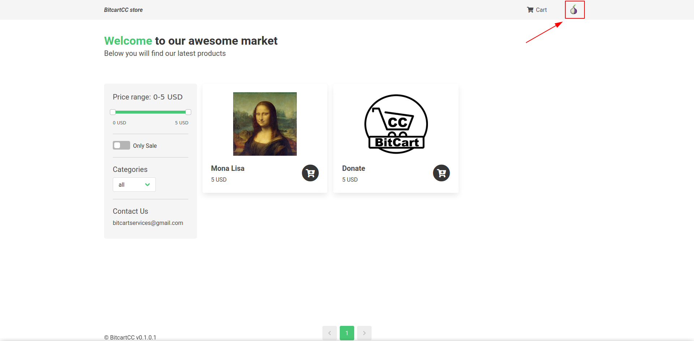
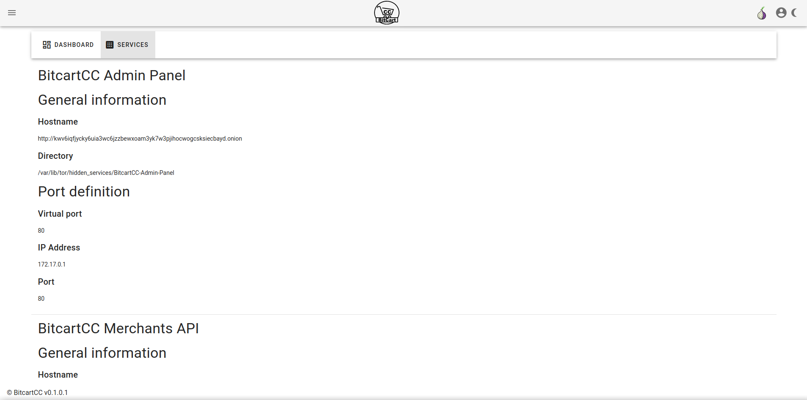
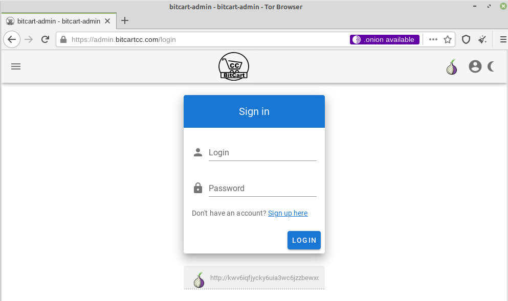

# Tor

Bitcart supports Tor as an additional service. When enabling it, all the services \(admin, merchants API, store\) will also be available as Tor hidden services.

When enabling Tor hidden services, nginx will automatically be configured to serve requests from .onion domains. But if using a custom reverse proxy or just not the built-in nginx, ensure to set up server records for each hidden service. More information below.

## Warning

Enabling Tor doesn't give absolute security. And if used incorrectly, it may even lead to bigger problems. It is very hard to make every component of Bitcart and it's dependencies use the onion network only, and we don't guarantee that.

When enabling tor, the components of Bitcart will be communicating via the onion URLs if accessed from the onion network too, and all the daemons will be connecting to the onion servers more often than regular ones.

So, Tor support is mostly to be used to access Bitcart components when running it at home, or behind a complex firewall.

## Enabling Tor support

To enable tor support, you will need to add additional component to the deployment.

Re-configure your instance like so:

```bash
export BITCART_ADDITIONAL_COMPONENTS=tor
./setup.sh
```

Note, if you have already had some additional components enabled before, separate them with comma.

## Checking if Tor support works

When enabled, the admin panel and store will have an onion icon.

Also, if opening any of the components in Tor browser, you will be automatically suggested to open the hidden service version of your site.

But if you need to get the hostname of some service without using the clearnet version of the site, you can run this command:

```bash
cat /var/lib/docker/volumes/compose_tor_servicesdir/_data/service/hostname
```

Where `compose` is the name of your deployment, by default it is indeed `compose`, and `service` is the service name you want to check, where spaces are replaced with `-` symbol.

Examples:

```bash
cat /var/lib/docker/volumes/compose_tor_servicesdir/_data/Bitcart-Merchants-API/hostname # for Merchants API
cat /var/lib/docker/volumes/compose_tor_servicesdir/_data/Bitcart-Admin-Panel/hostname # for admin panel
cat /var/lib/docker/volumes/compose_tor_servicesdir/_data/Bitcart-Store/hostname # for store
```




From the admin panel, you will also be able to check all the hidden services links for all services. Click on the services button to the right of the dashboard button.





