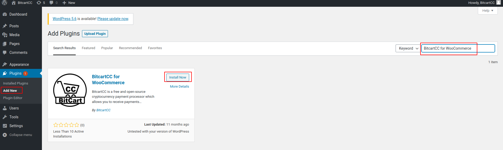
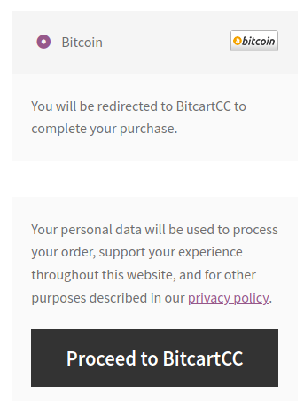

# WooCommerce

To install the woocommerce plugin for Bitcart, please follow the steps below



## Install the Bitcart Woocommerce plugin

### Via Wordpress

1. WordPress > Plugins > Add New.
2. In Search, type "Bitcart for WooCommerce"
3. Install and activate.

### From Github

Download the latest plugin [release](https://github.com/bitcart/bitcart-woocommerce/archive/master.zip), upload it in the .zip format to your wordpress instance and active it.

## Deploy Bitcart

Refer to our [deployment guide](../deployment/)

## Configure the plugin

Go to your store dashboard. WooCommerce > Settings > Payments. Click Bitcart.

1. Enter your Bitcart URL (URL of the Merchants API, like https://api.bitcart.ai)
2. Enter your Bitcart Admin Panel URL (for example, https://admin.bitcart.ai)
3. Change the store id used if needed
4. Save changes

## Test the checkout

If you have successfully configured your plugin, you will be able to checkout via cryptocurrency.

That's it!
