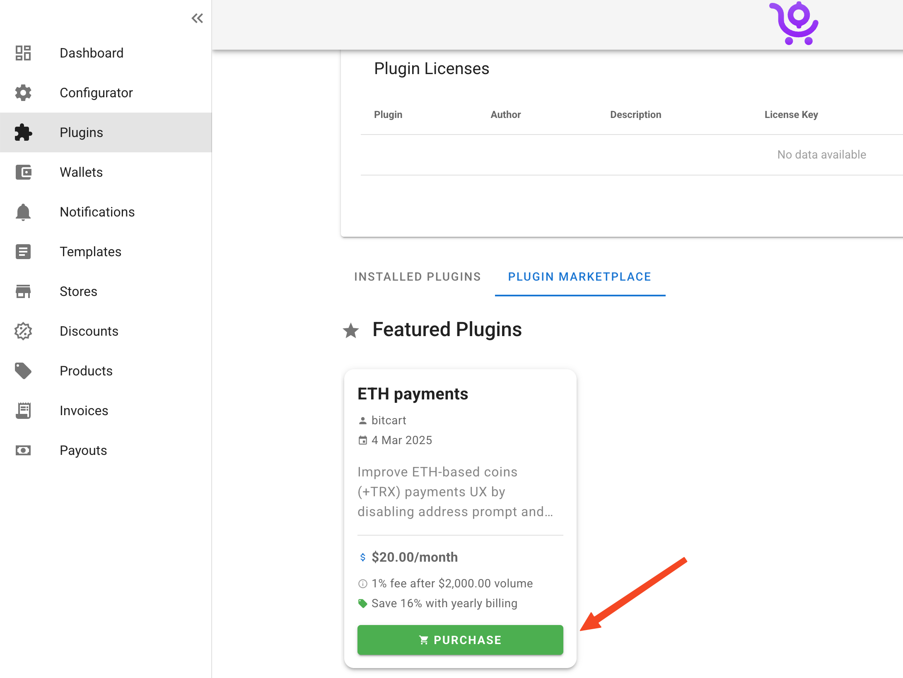
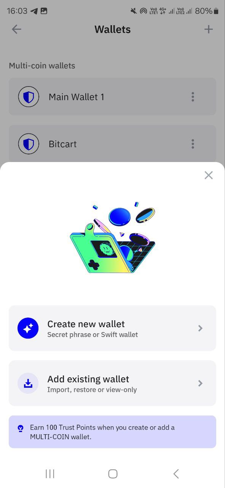
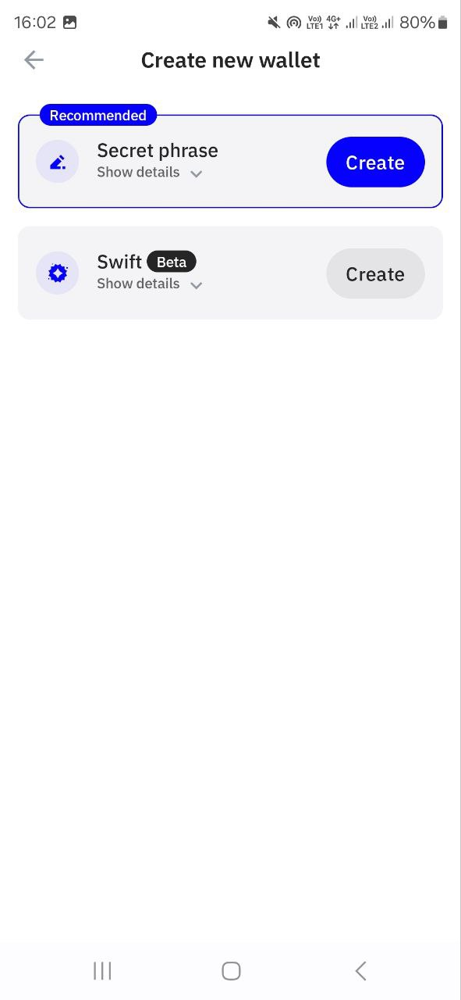
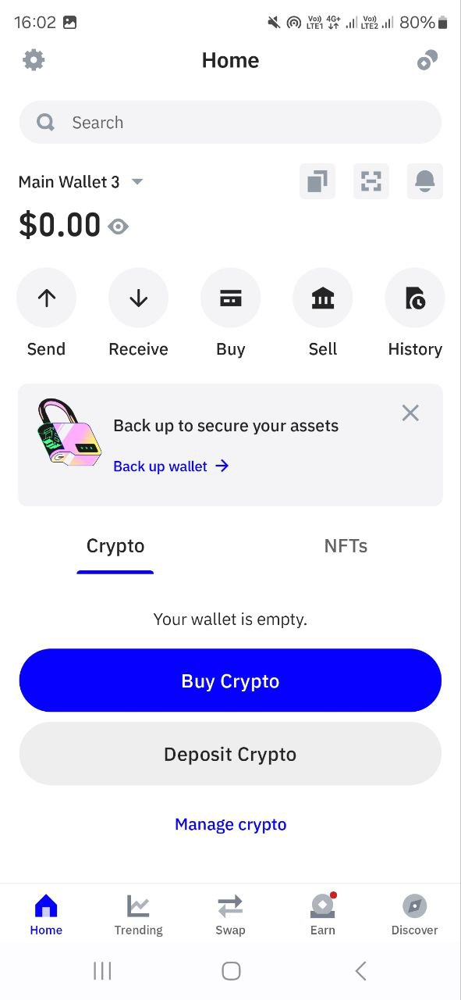
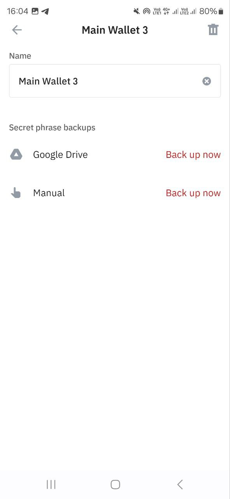
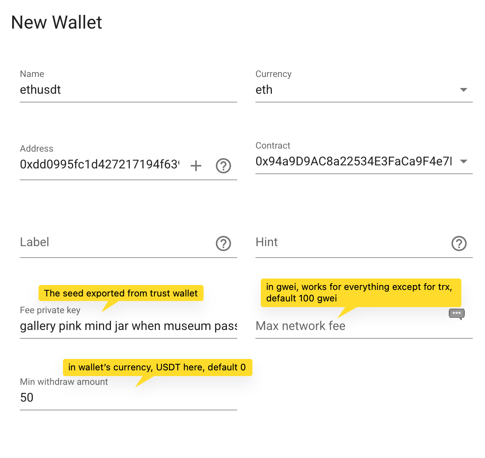

# ETH payments plugin

ETH payments plugin allows to improve payments UX of ETH-based coins (currently ETH, TRX, BNB, POL) and all their tokens (USDT, USDC and more on those chains) by disabling address prompt and accepting payments from exchanges. This allows you to boost your sales massively as this plugin allows you to accept all currencies Bitcart supports + ETH-based coins with the best UX possible while still remaining **non-custodial**, with **minimum security risks** and by **saving on network fees** (using **just 1 transfer** instead of the usual 2 to withdraw tokens from your pool addresses)

## Users guide

### Purchase

First of all, to buy the plugin, ensure you are running Bitcart v0.9.0.0 or later

Open your plugins page and click on purchase button:

<figure><figcaption><p>Purchase plugin flow</p></figcaption></figure>

After that you will be able to choose monthly or yearly billing.


Ensure the email address you enter is not a disposable one, it will be used to send you license key, billing invoices and plugin updates



If you have any issues with payment, please contact us at hello@bitcart.ai or in official community groups.


### Activation

After successful payment you will receive an email with your license key and plugin download URL. There is no need to download the plugin unless you have some custom setup, everything can be done in admin panel UI.

<figure><figcaption><p>Plugin activation email</p></figcaption></figure>

Next, head to plugins page and enter your license key there

<figure><figcaption><p>Add license key dialog</p></figcaption></figure>

<figure><figcaption><p>Plugin install button</p></figcaption></figure>

After you have added the key, purchase button will turn into install button. Just press it to install the plugin.

<figure><figcaption><p>Reload plugins button</p></figcaption></figure>

Don't forget to click the reload plugins button to apply changes. It will take a few minutes for plugin to build as it applies updates to the admin panel which take more time to build.

### Wallets setup

After that, address prompt should be removed automatically. If after 10+ minutes it doesn't disappear, please contact us

#### Native coins

For native coins (like ETH, TRX and others), when payment is received to the wallet pool address, it is sent to your primary address automatically, because when we have a native coin on address, we can just send all of it minus network fees to the primary address.

#### Tokens

For tokens (like USDT, USDC and others), it can't send payment to your primary address without paying network fees. As for tokens it is needed to pay network fee in native coin, and wallet pool addresses don't have it, that's why it is needed.

That's where the plugin shines in, it allows us to cut network fees by using only 1 transfer instead of 2.

First, you need to create a fresh wallet, which will be used only for paying network fees. Ensure to not deposit too much to it, as this is the only private key that is inserted into the system and has higher risks of being compromised if e.g. the server gets hacked. But your primary wallet is always safe as you just enter it's address.

Let's create a fresh wallet in let's say, trust wallet:

<figure><figcaption><p>Trust wallet create dialog</p></figcaption></figure>

<figure><figcaption><p>Seed phrase wallet</p></figcaption></figure>

<figure><figcaption><p>Main wallet page</p></figcaption></figure>

<figure><figcaption><p>Export seed page</p></figcaption></figure>

You can use the seed directly, or if you really want to have a private key specifically, you can do it for example with Bitcart cli by running this on server:

```bash
 ./bitcart-cli.sh -c coin --diskless -w "seed here" getprivatekeys
```


Note the space before the command. This is used to not save the seed into bash history.

Coin is eth, trx etc.


<figure><figcaption><p>Configuring wallet</p></figcaption></figure>

### Managing wallet pool

The plugin adds a new page for wallets: address pool management. It is accessible by clicking an icon near any of your eth-based wallets.

<figure><figcaption><p>Opening address pool page</p></figcaption></figure>

<figure><figcaption><p>Address pool management page</p></figcaption></figure>

This page is another key feature of the plugin: you can view all your addresses used in invoices from one page

Status has the following values:

* Free - ready to be re-used in upcoming invoices
* In invoice - attached to a currently active invoice. It is freed when invoice gets either expired or paid
* Pending payout - invoice with this address was paid, so it will be attempted to do a withdrawal. Actual withdrawal will happen only if it meets min withdrawal and network fee criteria, and for tokens, if fee private key was set and has enough balance
* In payout - payout is being performed right now

Init Status indicates whether the fee wallet is authorized to send payments to your primary wallet from this pool's address in just 1 transfer:

* Uninitialized - address is new and hasn't been set up yet. Ensure you have your fee private key set and that fee wallet has balance
* Initializing - address is in the process of being initialized
* Initialized - address is fully set up and ready to use. For non-token payments, this is always the case as no fee wallet is required.

If needed, you can trigger withdrawal manually if you click on withdraw button. Also batch withdraw and delete actions are available.

### Troubleshooting

If you want to view debug logs of the plugin, click on profile icon->server management->policies

And enable the debug checkbox near eth\_payments plugin:

<figure><figcaption><p>Enabling debug mode</p></figcaption></figure>

You will then be able to view debug logs in server logs of your instance.

## FAQ

### What makes the plugin worth it? How is it any different from all already existing solutions on the market?

The main difference is that, existing solutions are custodial and they store all information about your payments, customers and anything else they can get. Also custodial means money gets sent from your customers to their intermediate addresses, and only then sent to you. Which means if they want they can lock you out of your funds.

Bitcart on the other hand, operates by accepting payments **directly to your wallet**. Private key is never required either. For plugin to work it does require generating unique deposit addresses, but private keys for all addresses in your wallet pool are stored **in your local database** and not stored anywhere else. Which means, even in worst case you always have private keys to withdraw the funds, and the plugin automatically sends payments from pool addresses to your primary address without any manual intervention.

Also as everything is hosted on your own server, you have full control over your data: order information is never shared with anyone, **everything is stored on your server only**.

And another key feature is: when sending tokens from pool addresses where no native coin is present, the usual flow is 2 transfers: first, estimate the approximate amount of network fee needed for a token transfer, and send that to the pool address, wait for some time when it gets confirmed, and then send the tokens.

The plugin on the other hand requires only 1 transfer: if pool address is initialized, the fee wallet is able to send tokens from pool address to your primary address utilizing it's native coins, **avoiding the second transfer**. This makes it way more **reliable** and allows to **save on network fees**.

### Which information does the plugin collect?

The plugin collects minimal information possible for accurate billing and abuse control:

* Monthly volume done by using the plugin only (this is sent as a dictionary where key is invoice currency, value is total). No order information leaves your server, plugin uses database query to collect aggregate numbers only and send to license server for accurate billing
* Plugin version
* Machine ip + machine id. Used for abuse control, by default only 1 server can use the plugin at the same time. If you switch servers, wait 6 hours for the old plugin to stop sending license checks, then a new server can be switched to automatically. If you need it faster contact us and we'll reset machine binding

### What is monthly volume and how is it determined?

The plugin collects aggregate sum of paid invoices where payment method used is created by the plugin (so ETH-based coins only, coins untouched by the plugin are not billed) over the last month

The information is sent to license server where it uses it's exchange rates to combine it into one final USD amount.

### If I pick yearly billing, am I still billed for volume?

Yes, but only if you exceed the monthly 2000$ unbilled volume. The plugin price itself will be billed once a year, and each month where you do exceed the thresold, you will be billed only on the excess amount.

### How do you charge fees? Is it still non-custodial?

Yes, we don't intervene in your invoice generation or payouts at all. Everything is processed by your server. At the end of the month (your billing period), you will receive an email with bitcart invoice to pay. It is calculated based on your billing cycle and monthly volume stat. You have 7 days to pay the invoice until the plugin gets deactivated. If it does, you have to contact us and we can re-issue the invoice

