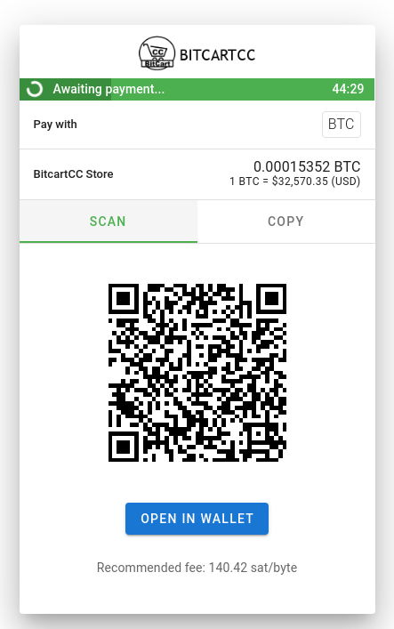
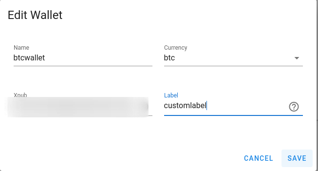
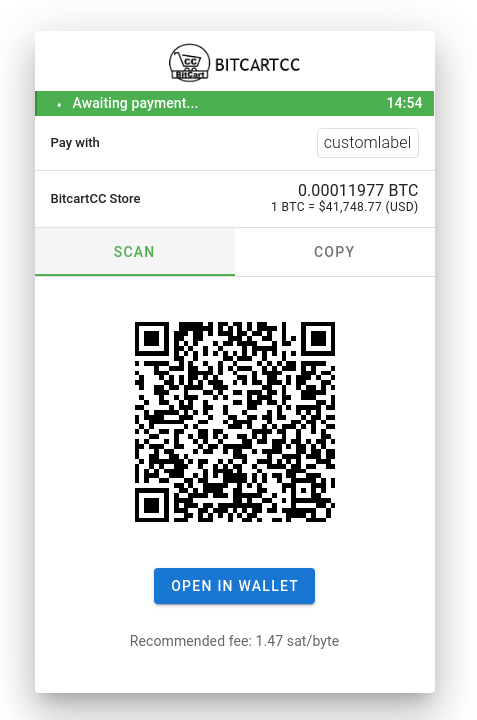

# Stores FAQ

## What is underpaid percentage?

Underpaid percentage is a store checkout setting, which can be in range from 0 to 99, indicating that the payment may be that percent less than expected, and it will still be accepted as paid. For example, if customer sends from an exchange wallet and the fees are deducted from the sent amount, the payment will still be accepted if you set underpaid percentage to a small non-zero value.

## What is the Use Dark Mode setting?

When enabling this store checkout setting, the checkout page will always be served in dark mode. Ensure to check that your logo is suitable for dark mode. 

## What is custom logo link?

To keep consistent branding, you can change the default BitcartCC logo to your own logo. For that, it must be accessible via the URL provided. Note that, no matter what resolution the image is, it will be fit into maximum height of 40.

## Recommended fee

Show recommended fee setting enables showing recommended fee for all onchain \(i.e. not lightning\) payment methods. 

To configure it, you need to set the recommended fee confirmation target blocks setting, which configures the fee displayed. If you set it to 2, it would mean it will show the recommended fee for the customer to pay for his payment to be confirmed in 2 blocks. Default value is 1.

## How do I change my payment method's name?

By default BitcartCC uses currency symbol as method name, and if there are multiple wallets of the same currency connected it adds an index to it \(BTC\(1\), BTC\(2\)\).

In some cases you may want to have a custom label for your payment methods, for example to indicate if some payment method is for legacy payments, and another is for segwit payments.

To do that, just add a label to your wallet:

