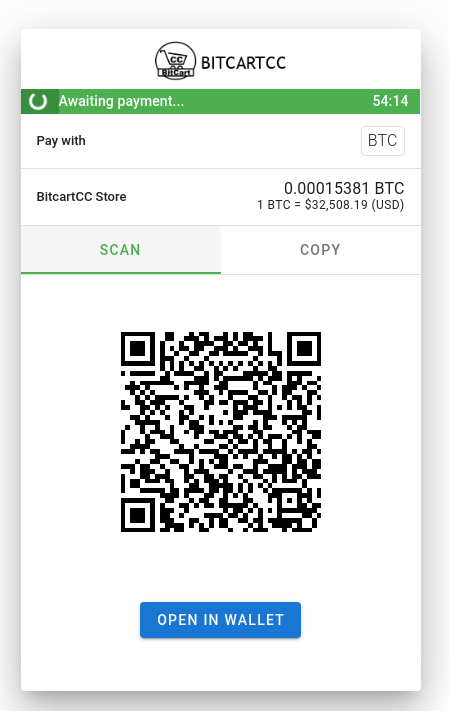
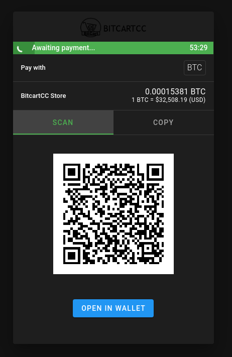
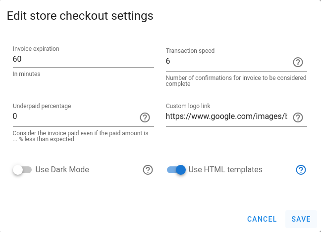
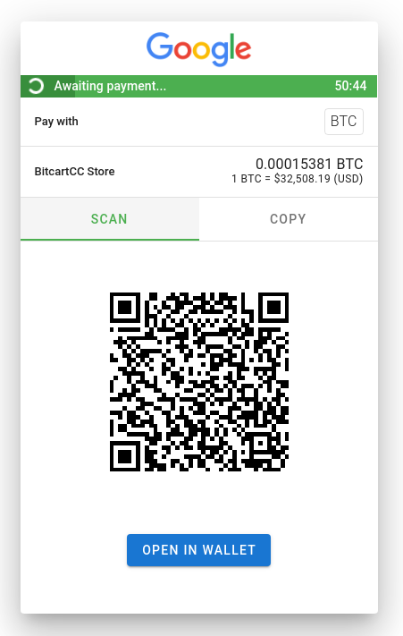

# Stores FAQ

## What is underpaid percentage?

Underpaid percentage is a store checkout setting, which can be in range from 0 to 99, indicating that the payment may be that percent less than expected, and it will still be accepted as paid. For example, if customer sends from an exchange wallet and the fees are deducted from the sent amount, the payment will still be accepted if you set underpaid percentage to a small non-zero value.

## What is the Use Dark Mode setting?

When enabling this store checkout setting, the checkout page will always be served in dark mode. Ensure to check that your logo is suitable for dark mode. 

## What is custom logo link?

To keep consistent branding, you can change the default BitcartCC logo to your own logo. For that, it must be accessible via the URL provided. Note that, no matter what resolution the image is, it will be fit into maximum height of 40.

