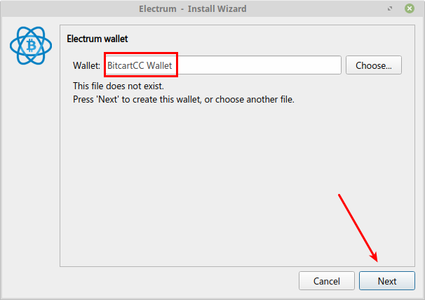
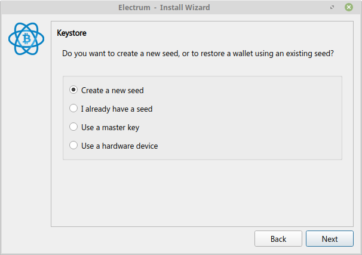
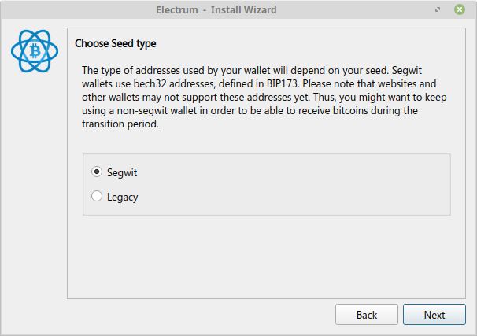
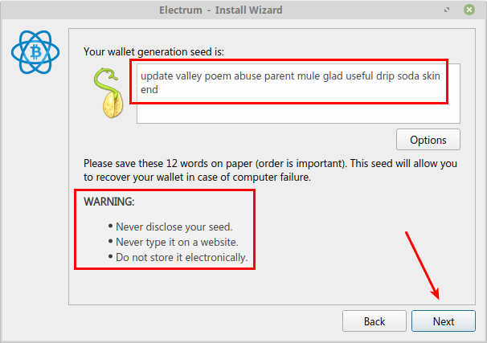
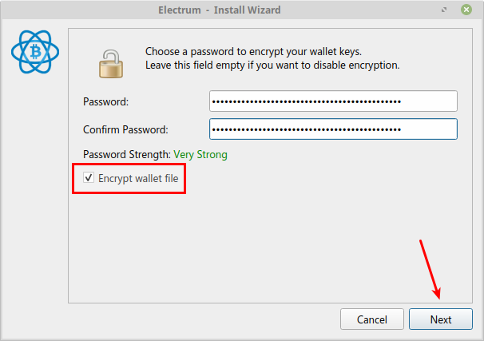
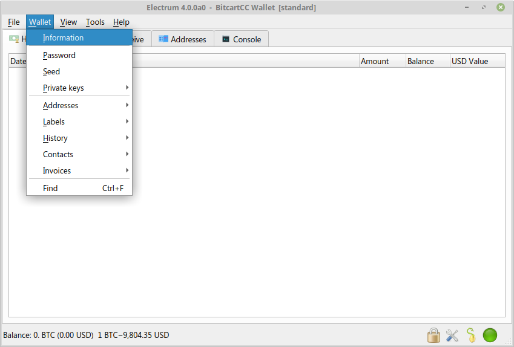
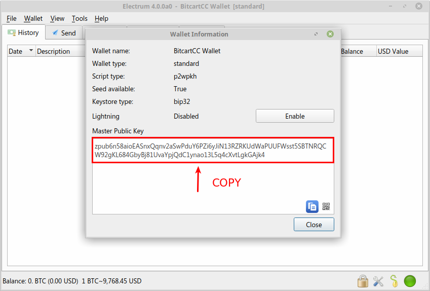
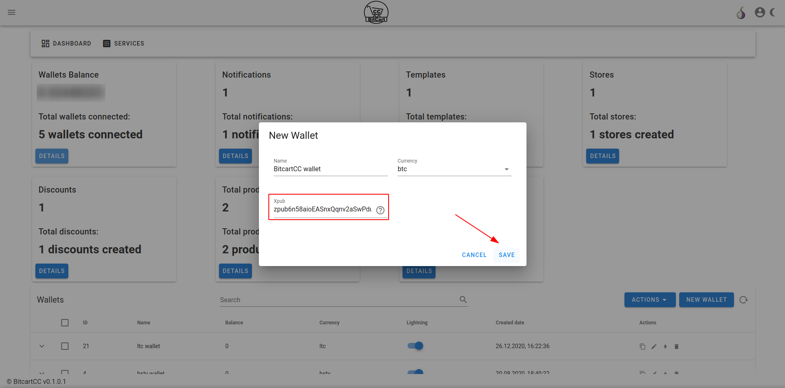
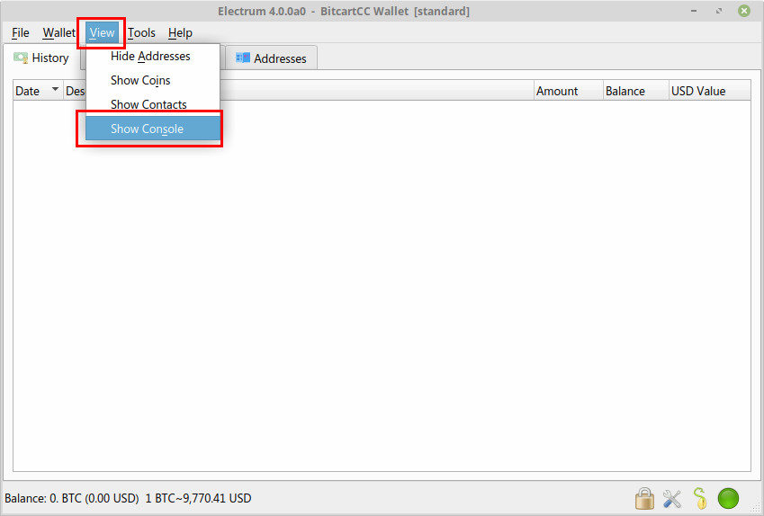
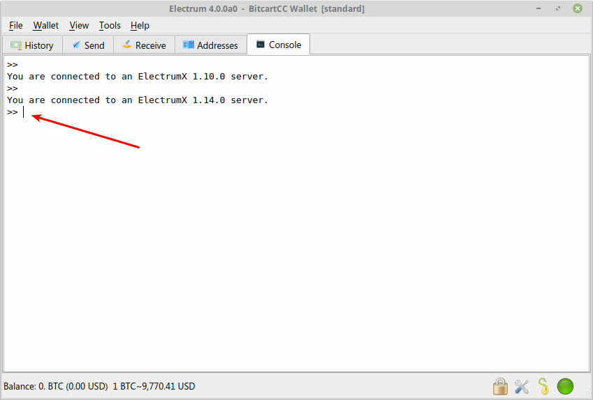

# Electrum wallet

This document explains how to connect a desktop [Electrum Wallet](https://electrum.org/) to Bitcart.

Electrum wallet is recommended, as Bitcart is tightly integrated with it, providing the best user experience and speed.

1. Register an account in your Bitcart instance
2. ​[Download](https://electrum.org/#download) and install Electrum Wallet

## Electrum Wallet Setup <a href="#electrum-wallet-setup" id="electrum-wallet-setup"></a>

After the installation, open Electrum Wallet by clicking on the icon on your desktop.

### Quick Setup <a href="#quick-setup" id="quick-setup"></a>

1. Create a new Electrum Wallet
2. In Electrum, Wallet > Information - copy the **Master Public Key**.
3. In Bitcart, Wallets > Create wallet > Paste the Extended Public Key in xpub field

## Step by Step <a href="#step-by-step" id="step-by-step"></a>

The following setup guides you through setting up an entirely new Bech32 (SegWit) Wallet in Electrum. If you already have a wallet skip to the Extended Public Key copying.

Firstly, give your wallet a name, for example, `Bitcart Wallet` and click `Next`.



Choose `Standard wallet` and proceed by clicking the `Next`button.


Since we're creating a brand-new wallet,choose `Create a new seed` and `Next`



From the multiple choice menu, select `SegWit` and `Next`



**IMPORTANT NOTE:** If you're a merchant, instead of SegWit (Bech32), it's recommended to use SegWit wrapped (P2SH) format. [This guide](https://www.youtube.com/watch?v=-1DBJWwA2Cw) explains how to create P2SH wallet in Electrum that's more suited for merchants, due to compatibility with legacy wallets customers use.

**IMPORTANT NOTE 2:** Write down your recovery words in the order you see them on the screen. Write them down a piece of paper and store it somewhere secure. Take your time and triple check each word. Do not store your seed in a digital format (photograph, text document). Whoever has the access to your seed can access your funds. Confirm that the seed has been properly backed up by re-entering it in the same order. Once the seed is validated, proceed to the next step.



It's highly recommended that you encrypt your wallet. Select a password that you can easily remember and mark make sure `Encrypt Wallet File` is marked. Proceed by clicking `Next`.



When the wallet loads (it may take few moments), in the top menu, click on the `Wallet` and then`Information` .



Select and **copy** the `Master Public Key`. This is the **public** key from which Bitcart will derive addresses.



Return to your Bitcart. Click on the `Details` button in the `Wallets` card and click on the `New Wallet` button. Enter your wallet name and Paste the Master Public Key from electrum to xpub field. Click `Save`.



### Configuring the Gap Limit in Electrum <a href="#configuring-the-gap-limit-in-electrum" id="configuring-the-gap-limit-in-electrum"></a>

In the top menu, click on the `View` and then`Show Console` .



Enter following commands in Electrum console and press `enter` on your keyboard.

```
 wallet.change_gap_limit(100) 
```

If you are running a version older than Electrum 4, also enter the following command and press `enter`

```
wallet.storage.write()
```



Restart your Electrum and verify that the newly set gap limit is correct by entering in the console:

```
wallet.gap_limit
```

There's no good answer to how much you should set the gap limit to. Most merchants set 100-200. If you're a big merchants with high transaction volume, you can try with even higher gap limit.

For more details about the Gap Limit, check the FAQ.

Electrum and Bitcart are now connected. Any payments received to your Bitcart will be visible in Electrum, where you can further spend them.
